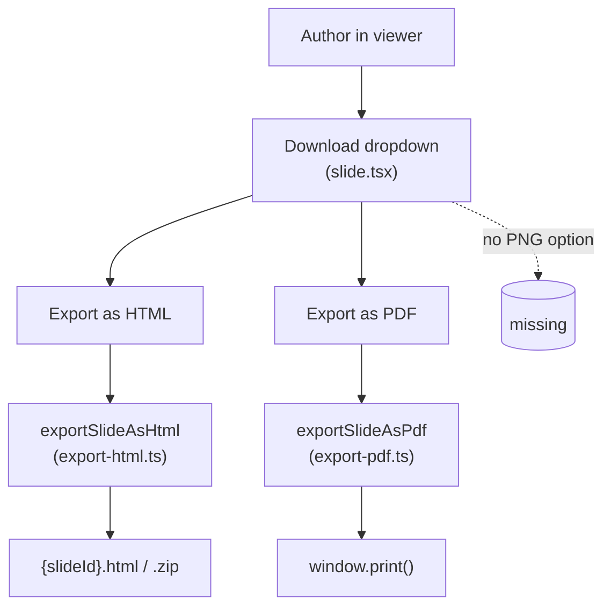
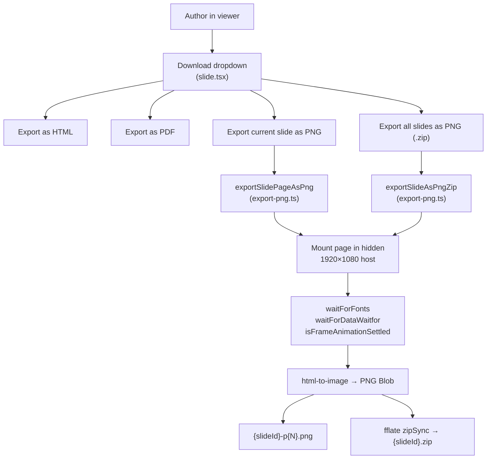
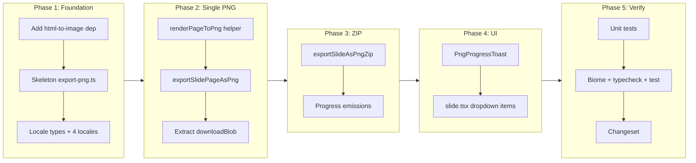

# Export slides as PNG

## Change Summary

The open-slide viewer currently lets authors download a deck as HTML or PDF, but there
is no way to obtain a pixel-perfect PNG of a slide. This CR adds a PNG export option
that renders the active slide page (and, on demand, every page) at the canonical
1920×1080 canvas size into a PNG file (single page) or a ZIP archive (whole deck),
reusing the existing offscreen render pipeline already proven by the PDF and HTML
exporters in `packages/core/src/app/lib/`.

## Motivation and Background

PNG is the lowest-friction way to embed a slide in a blog post, social card, README,
Notion page, Figma board, or design review. PDF is the right output for handout-style
delivery, and HTML is right for self-hosting, but neither is a drop-in raster. Authors
today have to screenshot the viewer at whatever zoom their browser happens to be using,
which produces fuzzy, off-aspect, watermarked-by-toolbar captures.

A PNG exporter that reuses the same offscreen 1920×1080 render path the PDF exporter
already uses gives authors a deterministic, design-token-correct raster of their slide
with no extra browser tools, no headless build step, and no behavioural drift from the
viewer they just authored against.

### Change Drivers

* Author feedback: screenshots of the viewer are blurry, cropped, or include UI chrome.
* Parity with `Export as HTML` / `Export as PDF` — PNG is the natural third option in
  the same download dropdown.
* Social / docs use: README hero images, blog cards, and design reviews all expect PNG.
* Avoids a server- or headless-Chromium-side renderer, which would inflate the size of
  the runtime that `@open-slide/core` ships to users.

## Current State

The viewer exposes two export paths, both implemented as client-side, in-browser
renderers that mount each page into a hidden 1920×1080 host and read the result:

* **HTML export** — `packages/core/src/app/lib/export-html.ts` renders every page into
  a hidden container, snapshots `innerHTML`, inlines `document.styleSheets`, fetches
  referenced assets, and downloads either a `.html` file or a `.zip` bundle.
* **PDF export** — `packages/core/src/app/lib/export-pdf.ts` mounts every page into
  `#os-print-root` at 1920×1080, waits for fonts and `data-waitfor` selectors, waits
  for intro animations via `isFrameAnimationSettled`, neutralises gradient backgrounds
  that Chromium serialises as PDF soft masks, and calls `window.print()`. Progress is
  surfaced through `PdfProgressToast`.

Both exports are wired up in `packages/core/src/app/routes/slide.tsx` behind a
`DropdownMenu` that is gated by `config.build.allowHtmlDownload`. Locale strings live
under `slide.exportAs*` / `pdfToast.*` in `packages/core/src/locale/*.ts` and are
mirrored in `packages/core/src/locale/types.ts`. The canvas size constants
`CANVAS_WIDTH = 1920` and `CANVAS_HEIGHT = 1080` come from
`packages/core/src/app/lib/sdk.ts`, and `<SlideCanvas>` is the in-viewer renderer.

There is no PNG export, no PNG-specific locale strings, no `allowPngDownload` config
flag, and no rasterisation utility in `packages/core`.

### Current State Diagram



## Proposed Change

Add an `Export as PNG` entry to the existing download dropdown that produces a
1920×1080 PNG of the *current* slide page, and a `.zip` archive of one PNG per page
when the author wants the whole deck.

The export MUST be a pure client-side rasterisation that reuses the same offscreen
1920×1080 mount pattern as `export-pdf.ts`, the same readiness waits from
`print-ready.ts` (fonts, `data-waitfor`, animation settle), and the same `fflate`
dependency for ZIP bundling that `export-html.ts` already uses.

Implementation MUST use the `html-to-image` library to rasterise the mounted DOM node
to a PNG `Blob`. `html-to-image` is preferred over `html2canvas` because it has zero
runtime dependencies (vs. html2canvas's larger footprint) and produces correct output
for modern CSS (gradients, filters, transforms) that the viewer relies on.

> **Assumption** (open question, see end of document): we depend on `html-to-image`
> rather than a hand-rolled `foreignObject`-into-`<canvas>` snippet. Rationale: a
> from-scratch implementation has to re-derive computed style inlining, web-font
> embedding, srcset resolution, and `dataURI`-rewriting of cross-origin images, all of
> which `html-to-image` already handles. The "no casual dependencies" rule still
> applies — this is justified, not casual.

### Proposed State Diagram



## Requirements

### Functional Requirements

1. The runtime **MUST** expose a new export entry point
   `exportSlidePageAsPng(slide, slideId, pageIndex)` in
   `packages/core/src/app/lib/export-png.ts` that returns a `Promise<void>` and
   triggers a browser download of a PNG file named
   `{slideId}-p{pageIndex+1, zero-padded to width of total pages}.png`.
2. The runtime **MUST** expose a second export entry point
   `exportSlideAsPngZip(slide, slideId, onProgress?)` in the same module that returns
   a `Promise<void>` and triggers a browser download of a ZIP archive
   `{slideId}.zip` containing one PNG per page, named with the same
   `{slideId}-p{N}.png` convention.
3. Each PNG **MUST** be rendered at exactly `CANVAS_WIDTH` × `CANVAS_HEIGHT` (1920×1080)
   regardless of the viewport size or zoom level of the calling tab.
4. The exporter **MUST** mount each page into an offscreen container positioned at
   `left: -99999px` (mirroring `export-html.ts`) so the user does not see flicker.
5. The exporter **MUST** apply the slide's `design` tokens via `designToCssVars` to the
   offscreen host, so the PNG matches the in-viewer rendering.
6. The exporter **MUST** wrap each page in `<SlidePageProvider>` so
   `useSlidePageNumber()` and other page-context-dependent components render correctly.
7. The exporter **MUST** wait for fonts via `waitForFonts()` before rasterising any
   page.
8. The exporter **MUST** wait for `data-waitfor` selectors via `waitForDataWaitfor()`
   before rasterising any page.
9. The exporter **MUST** poll `isFrameAnimationSettled` for each mounted frame with the
   same 15 000 ms timeout used by the PDF exporter, and rasterise the frame only after
   it settles or the timeout elapses.
10. The full-deck (`exportSlideAsPngZip`) exporter **MUST** report progress through an
    optional `onProgress` callback shaped as
    `{ phase: 'processing' | 'rasterising' | 'zipping' | 'done', current: number, total: number, percent: number }`,
    matching the shape used by `PdfExportProgress` so the same toast component pattern
    can render it.
11. A new component
    `packages/core/src/app/components/png-progress-toast.tsx` **MUST** render the
    progress state, mirroring the visual treatment of `pdf-progress-toast.tsx`.
12. The download dropdown in `packages/core/src/app/routes/slide.tsx` **MUST** include
    two new `DropdownMenuItem`s — `Export current slide as PNG` and
    `Export all slides as PNG` — placed below the existing PDF item.
13. New locale keys **MUST** be added to `packages/core/src/locale/types.ts` and to
    every locale file (`en.ts`, `ja.ts`, `zh-cn.ts`, `zh-tw.ts`):
    `slide.exportCurrentPageAsPng`, `slide.exportAllPagesAsPng`,
    `slide.pngExportFailed`, `pngToast.title`, `pngToast.processing`,
    `pngToast.rasterising`, `pngToast.zipping`, `pngToast.done`.
14. The PNG dropdown items **MUST** be gated by the same `config.build.allowHtmlDownload`
    flag that already gates the HTML and PDF items, so a single user-facing toggle
    controls all downloads.
15. The exporter **MUST** clean up its offscreen mount, React roots, and any injected
    style/element on both success and failure paths (mirroring the `finally` block in
    `exportSlideAsPdf`).
16. On rasterisation failure the exporter **MUST NOT** leave any DOM node, React root,
    or object URL attached, and **MUST** surface the failure to the caller via a
    rejected promise so the caller can show `slide.pngExportFailed` via `sonner`.
17. Downloaded files **MUST** be triggered through a hidden `<a download>` click and
    the resulting object URL **MUST** be revoked after the click, matching the
    `downloadBlob` helper already in `export-html.ts`.

### Non-Functional Requirements

1. The PNG exporter module **MUST** stay under ~250 lines of TypeScript, in line with
   the project's small-single-purpose-files rule, and **MUST** live in a single file
   `packages/core/src/app/lib/export-png.ts` with hierarchical-namespace naming.
2. The added dependency `html-to-image` **MUST** be the only new runtime dependency
   introduced by this CR, and its bundle impact **MUST** be documented in the
   changeset description.
3. The exporter **MUST** complete a single-page PNG export of a representative slide
   in under 4 seconds on a 2024-class laptop running Chromium, measured locally
   during review.
4. The exporter **MUST NOT** block the viewer's main React tree: the offscreen mount
   uses its own `createRoot` and is removed before control returns to the caller.
5. The new code **MUST** pass `pnpm check` (Biome) and `pnpm typecheck` with zero
   warnings.
6. The change **MUST** include a Changeset entry against `@open-slide/core` with a
   single-line, user-perspective description per `CLAUDE.md`.
7. Docstrings on every exported function in `export-png.ts` **MUST** explain *why*
   (the design constraint each function satisfies), not just *what*, per
   `documentation_standards`.

## Affected Components

* `packages/core/src/app/lib/export-png.ts` — **new**, the rasterisation entry points.
* `packages/core/src/app/lib/print-ready.ts` — read-only consumer; no edits unless a
  helper needs to be extracted.
* `packages/core/src/app/components/png-progress-toast.tsx` — **new**, mirrors
  `pdf-progress-toast.tsx`.
* `packages/core/src/app/routes/slide.tsx` — adds two `DropdownMenuItem`s, two click
  handlers, and a second `exporting` lock (or reuses the existing one).
* `packages/core/src/locale/types.ts` — adds the new locale keys to the type contract.
* `packages/core/src/locale/en.ts`, `ja.ts`, `zh-cn.ts`, `zh-tw.ts` — adds the
  translated strings.
* `packages/core/package.json` — adds `html-to-image` to `dependencies`.
* `.changeset/<slug>.md` — minor bump for `@open-slide/core` (new public-ish API
  surface in the viewer download menu).

## Scope Boundaries

### In Scope

* Client-side PNG rasterisation of the *current* slide page from the viewer.
* Client-side ZIP-of-PNGs rasterisation of *all* pages in a deck.
* Progress toast for the multi-page export.
* Locale strings in all four supported locales.
* Reuse of existing `waitForFonts`, `waitForDataWaitfor`, `isFrameAnimationSettled`,
  `designToCssVars`, and `SlidePageProvider`.
* Adding `html-to-image` as a `@open-slide/core` runtime dependency and documenting it
  in the changeset.
* Updating `packages/core/src/app/routes/slide.tsx` so the download dropdown shows the
  new entries when `allowHtmlDownload` is true.

### Out of Scope ("Here, But Not Further")

* **Headless / build-time PNG generation.** No new `open-slide build` subcommand and
  no headless-Chromium dependency. The PDF exporter already chose the client-side
  path; PNG follows the same trade-off.
* **JPEG, WebP, or AVIF output.** Format selection is deferred to a future CR.
* **Custom resolution / scale factors.** Output is fixed at 1920×1080. A scale slider
  (e.g. 2× for retina) is deferred.
* **Per-element export.** No "export this element as PNG" affordance; the unit is one
  slide page.
* **PNG export from the presenter window or fullscreen present mode.** The dropdown
  only renders in the viewer.
* **CLI-driven exports (`open-slide export …`).** This CR adds no new CLI subcommand.
* **`packages/cli` changes.** The scaffolder is untouched.
* **Themes gallery / asset library exports.** Out of scope; only `/s/:slideId` exports.
* **Animated PNG / capturing intro animations as a sequence.** A single steady-state
  rasterisation per page only.
* **Configurable filenames.** Naming is fixed at `{slideId}-p{N}.png` /
  `{slideId}.zip`.

## Alternative Approaches Considered

* **Headless Chromium via the `open-slide build` CLI.** Produces the most reliable
  raster (server-managed fonts, no tab visibility issues). Rejected because
  `puppeteer` / `playwright` would balloon `@open-slide/core`'s install size and
  break the "runtime ships to users" constraint in `CLAUDE.md`.
* **Hand-rolled `<foreignObject>` + `<canvas>.drawImage`.** Zero new dependencies.
  Rejected because we would re-implement computed-style inlining, web-font embedding,
  CORS-safe image rewriting, and SVG-`<foreignObject>` quirk handling — all of which
  `html-to-image` already solves. The maintenance surface outweighs the dependency.
* **`html2canvas`.** Larger footprint, weaker support for modern CSS (filters,
  `mix-blend-mode`, modern gradients) than `html-to-image`. Rejected for output
  fidelity.
* **Reuse the PDF print path and convert PDF → PNG client-side.** Requires a PDF
  rasteriser in the bundle (e.g. `pdf.js`), which is heavier than `html-to-image` and
  inherits the Safari `window.print()` limitation already documented for PDF export.
* **Save the visible viewer DOM directly (no offscreen mount).** Rejected because the
  viewer renders a fitted, transformed `<SlideCanvas>`; the visible DOM is the wrong
  size and includes the UI chrome.

## Impact Assessment

### User Impact

* Slide authors gain a one-click PNG of the current slide and a one-click ZIP of all
  slides as PNGs, with the same visual fidelity as the viewer.
* Behaviour of HTML and PDF export is unchanged.
* Users who self-host with `allowHtmlDownload: false` see no new UI.

### Technical Impact

* Adds one new runtime dependency (`html-to-image`) to `@open-slide/core`. Install
  size increases by the size of that package; the changeset description must call
  this out so downstream consumers see it on upgrade.
* No breaking API changes. `index.ts` is not expanded — the new exports are internal
  to the viewer.
* The added `slide.tsx` UI must continue to satisfy Biome formatting / lint, and the
  shadcn-generated `ui/` directory is not touched.
* The export reuses the same offscreen-mount pattern already battle-tested by the PDF
  exporter, so risk to viewer stability is bounded.

### Business Impact

* Closes a "where's the PNG button?" feedback item without committing to a server-side
  rendering pipeline.
* Keeps `@open-slide/core` shippable as a pure npm package — no host requirements
  change.

## Implementation Approach

Sequenced so each phase is independently reviewable.

### Phase 1: Foundation — locale + module skeleton

1. Add `html-to-image` to `packages/core/package.json` `dependencies`. Pin to the
   current latest stable. Run `pnpm install` at the repo root.
2. Create `packages/core/src/app/lib/export-png.ts` with the public signatures
   `exportSlidePageAsPng` and `exportSlideAsPngZip`, plus a `PngExportProgress` type
   shaped identically to `PdfExportProgress` (substituting the `phase` enum).
3. Add new locale keys to `packages/core/src/locale/types.ts`
   (`slide.exportCurrentPageAsPng`, `slide.exportAllPagesAsPng`,
   `slide.pngExportFailed`, the full `pngToast` block).
4. Translate the new keys in `en.ts`, `ja.ts`, `zh-cn.ts`, `zh-tw.ts`.

**Affected components:** `packages/core/package.json`,
`packages/core/src/app/lib/export-png.ts` (new),
`packages/core/src/locale/types.ts`, `packages/core/src/locale/en.ts`,
`packages/core/src/locale/ja.ts`, `packages/core/src/locale/zh-cn.ts`,
`packages/core/src/locale/zh-tw.ts`.

### Phase 2: Core — single-page rasterisation

1. Implement an internal helper `renderPageToPng(slide, pageIndex): Promise<Blob>`
   that:
   1. Creates a hidden offscreen container styled like `export-html.ts`'s
      `renderPagesToHtml` host (`position: fixed; left: -99999px;
      width: 1920px; height: 1080px; pointer-events: none;`).
   2. Mounts the page via `createRoot` and renders
      `<SlidePageProvider index={i} total={pages.length}><Page /></SlidePageProvider>`,
      then awaits two `requestAnimationFrame` ticks (matching `export-html.ts`).
   3. Applies `designToCssVars(slide.design)` to the host so brand tokens resolve.
   4. Awaits `waitForFonts()`.
   5. Awaits `waitForDataWaitfor(host)`.
   6. Polls `isFrameAnimationSettled(host)` with the same `ANIMATION_TIMEOUT_MS` /
      `POLL_INTERVAL_MS` as `export-pdf.ts`.
   7. Calls `htmlToImage.toBlob(host, { width: 1920, height: 1080, pixelRatio: 1,
      cacheBust: false, backgroundColor: '#ffffff' })`.
   8. Unmounts the React root and removes the host on both success and failure.
2. Implement `exportSlidePageAsPng(slide, slideId, pageIndex)` as a thin wrapper that
   calls `renderPageToPng`, names the file
   `${slideId}-p${String(pageIndex + 1).padStart(width, '0')}.png`, and downloads it
   via a `downloadBlob` helper.
3. Extract `downloadBlob` into a shared helper file
   `packages/core/src/app/lib/download.ts` (small, one purpose) and import it from
   both `export-html.ts` and `export-png.ts` — this satisfies DRY without coupling the
   two exporters to each other.

**Affected components:** `packages/core/src/app/lib/export-png.ts`,
`packages/core/src/app/lib/download.ts` (new),
`packages/core/src/app/lib/export-html.ts` (replace its local `downloadBlob` with the
shared import).

### Phase 3: Core — full-deck ZIP export

1. Implement `exportSlideAsPngZip(slide, slideId, onProgress?)` that:
   1. Iterates pages, calling `renderPageToPng` once per page.
   2. Emits `onProgress({ phase: 'processing', ... })` while pages are mounted /
      waiting, `phase: 'rasterising'` during the `toBlob` call, `phase: 'zipping'`
      while `fflate.zipSync` runs, and `phase: 'done'` on completion.
   3. Builds a flat ZIP via `fflate.zipSync` keyed by
      `${slideId}-p${padded}.png` → `Uint8Array`.
   4. Downloads the result via the shared `downloadBlob` as `${slideId}.zip`.
2. Ensure every code path goes through a `try/finally` that tears down offscreen
   mounts even on `toBlob` rejection or zip failure.

**Affected components:** `packages/core/src/app/lib/export-png.ts`.

### Phase 4: UI — progress toast and dropdown entries

1. Create `packages/core/src/app/components/png-progress-toast.tsx` mirroring
   `pdf-progress-toast.tsx`, consuming `PngExportProgress` and `pngToast.*` locale
   strings.
2. Edit `packages/core/src/app/routes/slide.tsx` to:
   1. Import `exportSlidePageAsPng`, `exportSlideAsPngZip`, and `PngProgressToast`.
   2. Add two new `DropdownMenuItem`s under the existing PDF item, gated by the same
      `view === 'slides' && allowHtmlDownload` guard.
   3. Wire `Export current slide as PNG` to `exportSlidePageAsPng(slide, slideId,
      currentPageIndex)` using the same `exporting` lock and `try/finally`.
   4. Wire `Export all slides as PNG` to `exportSlideAsPngZip(slide, slideId,
      progressCallback)` with a `toast.custom` lifecycle identical to the PDF flow,
      using `PngProgressToast`.
   5. Use a stable `toastId` of `png-export-${slideId}`.
3. Pick appropriate `lucide-react` icons for the two items
   (e.g. `Image` for the single page, `Images` for the ZIP).

**Affected components:** `packages/core/src/app/components/png-progress-toast.tsx`
(new), `packages/core/src/app/routes/slide.tsx`.

### Phase 5: Tests, changeset, polish

1. Add unit tests per the Test Strategy below.
2. Run `pnpm check`, `pnpm typecheck`, `pnpm test`.
3. Run `pnpm changeset` and write a single-line minor-bump entry for
   `@open-slide/core`, e.g.
   `Add "Export as PNG" entry to the viewer download menu.`
4. Smoke-test against `apps/demo`: open a representative deck, export current page,
   open the PNG, eyeball at 100 %; export all pages, unzip, eyeball at 100 %.

**Affected components:** `packages/core/src/app/lib/export-png.test.ts` (new),
`.changeset/<slug>.md` (new).

### Implementation Flow



## Test Strategy

### Tests to Add

| Test File | Test Name | Description | Inputs | Expected Output |
|-----------|-----------|-------------|--------|-----------------|
| `packages/core/src/app/lib/export-png.test.ts` | `filename for single-page export uses zero-padded page index` | Verifies the helper that names files produces `slide-p01.png` for a 9-page deck and `slide-p001.png` for a 100-page deck. | `slideId = 'slide'`, `pageIndex = 0`, `total = 9` and `total = 100` | `'slide-p1.png'` (width 1) and `'slide-p001.png'` (width 3) — exact format set by implementation, asserted in test. |
| `packages/core/src/app/lib/export-png.test.ts` | `progress emitter produces monotonically non-decreasing percent` | Calls the internal progress reducer with a sequence of phase/current/total inputs and asserts `percent` never decreases. | Sequence of `{phase, current, total}` tuples covering processing → rasterising → zipping → done. | Each successive `percent` is `>=` previous. |
| `packages/core/src/app/lib/export-png.test.ts` | `exportSlidePageAsPng rejects with no DOM residue when html-to-image throws` | Mocks `html-to-image.toBlob` to reject. Asserts the offscreen container has been removed from `document.body` after the rejection. | Mocked `toBlob` rejection; jsdom environment. | Promise rejects; `document.querySelectorAll('[data-png-export-host]')` returns empty NodeList. |
| `packages/core/src/app/lib/export-png.test.ts` | `exportSlideAsPngZip calls onProgress at least once per phase` | Mocks `toBlob` to resolve and asserts onProgress sees all four phases at least once. | 2-page slide module; mocked `toBlob`. | onProgress called with `processing`, `rasterising`, `zipping`, `done` at least once each. |
| `packages/core/src/app/lib/download.test.ts` | `downloadBlob creates and revokes object URL` | Verifies the extracted helper triggers an `<a download>` click and revokes the URL afterwards. | `Blob` + filename. | `URL.createObjectURL` called once; `URL.revokeObjectURL` called once; `<a>` removed from DOM. |

### Tests to Modify

| Test File | Test Name | Current Behavior | New Behavior | Reason for Change |
|-----------|-----------|------------------|--------------|-------------------|
| _none_ | _n/a_ | _n/a_ | _n/a_ | No existing test currently asserts behaviour that this CR changes. `export-html.ts`'s tests (if any) cover HTML output, not the local `downloadBlob`; the extraction in Phase 2 is a refactor with identical external behaviour. |

### Tests to Remove

| Test File | Test Name | Reason for Removal |
|-----------|-----------|-------------------|
| _none_ | _n/a_ | No tests are removed by this CR. |

## Acceptance Criteria

### AC-1: Single-page PNG export downloads a 1920×1080 file

```gherkin
Given a user is viewing slide "intro" with three pages and is on page 2
  And `config.build.allowHtmlDownload` is true
When the user opens the download dropdown and selects "Export current slide as PNG"
Then the browser downloads a file named "intro-p2.png" (or equivalent zero-padded form)
  And the downloaded image has pixel dimensions 1920 × 1080
  And no toast error is shown
  And no offscreen export host remains attached to `document.body`
```

### AC-2: Full-deck PNG ZIP export downloads one PNG per page

```gherkin
Given a user is viewing slide "deck" with five pages
  And `config.build.allowHtmlDownload` is true
When the user opens the download dropdown and selects "Export all slides as PNG"
Then a progress toast appears with the `pngToast.title` string
  And the toast progress advances through "processing", "rasterising", "zipping"
  And the browser downloads a file named "deck.zip"
  And the archive contains exactly five entries named "deck-p1.png" … "deck-p5.png"
  And each entry is a valid PNG of 1920 × 1080 pixels
  And the toast is dismissed after the download is triggered
```

### AC-3: PNG entries are hidden when downloads are disabled

```gherkin
Given a project sets `build.allowHtmlDownload` to false in `open-slide.config.ts`
When the user opens the viewer download dropdown
Then no "Export current slide as PNG" entry is visible
  And no "Export all slides as PNG" entry is visible
  And the existing HTML and PDF entries are also hidden (unchanged behaviour)
```

### AC-4: Failure path surfaces a toast and cleans up

```gherkin
Given the slide contains a page that throws during render
  And the user selects "Export current slide as PNG"
When the export pipeline rejects
Then a sonner toast with the `slide.pngExportFailed` string is displayed
  And no offscreen container, React root, or object URL remains
  And the download dropdown is re-enabled (the `exporting` lock is released)
```

### AC-5: Rendered PNG uses the slide's design tokens

```gherkin
Given a slide declares a custom `design` with a brand colour different from default
When the user exports the current page as PNG
Then the exported PNG renders the page using the slide's `design` tokens
  And does not fall back to the default open-slide palette
```

### AC-6: Page-number context is correct in exported PNG

```gherkin
Given a slide has a component that calls `useSlidePageNumber()` and prints the page number
  And the deck has four pages
When the user exports all slides as PNG
Then each PNG shows the correct 1-based page number for its page
  And page 1's PNG shows "1", page 4's PNG shows "4"
```

### AC-7: Locale strings render in all supported locales

```gherkin
Given a project configures `locale` to `ja`
When the user opens the download dropdown
Then the new PNG entries render in Japanese using the `slide.exportCurrentPageAsPng`
   and `slide.exportAllPagesAsPng` keys from `ja.ts`
  And the same holds for `en`, `zh-cn`, and `zh-tw`
```

### AC-8: Biome and TypeScript remain clean

```gherkin
Given the branch contains the full implementation of this CR
When `pnpm check` and `pnpm typecheck` are run from the repo root
Then both commands exit with code 0 and emit no warnings
```

### AC-9: Changeset entry is present

```gherkin
Given the branch contains the full implementation of this CR
When the maintainer inspects `.changeset/`
Then a new markdown file exists with a `minor` bump for `@open-slide/core`
  And the description is a single line, present-tense, user-perspective sentence
```

## Quality Standards Compliance

### Build & Compilation

- [ ] `pnpm build` completes for `packages/core` without errors
- [ ] No new TypeScript compiler errors or warnings

### Linting & Code Style

- [ ] `pnpm check` (Biome) passes with zero warnings/errors
- [ ] No code added under `packages/core/src/app/components/ui/` (shadcn-generated)
- [ ] No casual comments; only comments where the WHY is non-obvious
- [ ] File names follow hierarchical-namespace convention
  (`export-png.ts`, `png-progress-toast.tsx`, `download.ts`)

### Test Execution

- [ ] `pnpm test` passes locally
- [ ] New tests in `export-png.test.ts` and `download.test.ts` pass
- [ ] No existing test in `packages/core` regresses

### Documentation

- [ ] Every exported function in `export-png.ts` has a docstring explaining intent
- [ ] `PngExportProgress` type has field-level docstrings matching `PdfExportProgress`
- [ ] No changes to `README.md` are required (the download menu is self-explanatory)

### Code Review

- [ ] Changes submitted via a single pull request
- [ ] PR title follows Conventional Commits, e.g.
  `feat(core): add PNG export to the viewer download menu`
- [ ] Squash-merged to maintain linear history
- [ ] Changeset committed under `.changeset/`

### Verification Commands

```bash
# From the repo root
pnpm install
pnpm check
pnpm typecheck
pnpm test
pnpm build

# Dogfood
pnpm dev   # opens apps/demo, exercise the new dropdown items
```

## Risks and Mitigation

### Risk 1: `html-to-image` produces incorrect output for advanced CSS used by themes

**Likelihood:** medium
**Impact:** medium
**Mitigation:** Smoke-test against every preset in
`packages/core/src/app/lib/design-presets.ts` during Phase 5. If a specific CSS feature
breaks, replicate the `neutralizeGradientBackgrounds` workaround the PDF exporter
already uses, scoped to the offscreen host only.

### Risk 2: Bundle size growth from `html-to-image` exceeds tolerance

**Likelihood:** low
**Impact:** medium
**Mitigation:** Confirm the installed size before merging. If unacceptable,
dynamically `await import('html-to-image')` from inside `renderPageToPng` so the
chunk is only fetched when the user clicks Export PNG, matching how `export-html.ts`
already lazy-loads `fflate` via `await import('fflate')`.

### Risk 3: Animation-settle timeout differs from PDF behaviour and confuses users

**Likelihood:** low
**Impact:** low
**Mitigation:** Reuse the exact `ANIMATION_TIMEOUT_MS = 15_000` and
`POLL_INTERVAL_MS = 100` constants from `export-pdf.ts` so the perceived "long
animations are skipped at this point" behaviour is identical across exports.

### Risk 4: Cross-origin assets fail to embed and the PNG shows broken images

**Likelihood:** medium
**Impact:** medium
**Mitigation:** `html-to-image` fetches assets via `fetch` and inlines them as
data URIs. For assets served by the open-slide dev server this is same-origin and
safe. Document the cross-origin limitation in the changeset; if a real failure
surfaces in dogfood, fall back to converting visible `` elements to data URIs
before calling `toBlob`, reusing the `findHtmlAssetUrls` / `toAbsolute` helpers from
`export-html.ts`.

### Risk 5: Memory pressure when exporting decks with many pages

**Likelihood:** low
**Impact:** medium
**Mitigation:** `exportSlideAsPngZip` mounts and tears down one page at a time
(rather than all pages concurrently like `export-pdf.ts`), keeping peak DOM size to a
single 1920×1080 host plus one PNG `Blob`. The `Blob`s are released to `fflate` and
the offscreen host is removed before the next page mounts.

### Risk 6: The shared `downloadBlob` refactor regresses HTML export

**Likelihood:** low
**Impact:** low
**Mitigation:** The extraction is a pure cut-and-import. `export-html.ts` is covered
by smoke-test in Phase 5 (download a `.html` and a `.zip` from the demo deck).

## Dependencies

* Runtime dependency on `html-to-image` (new) must be added to
  `packages/core/package.json`.
* No blocking CRs — this is `CR-0001`.
* No infrastructure or third-party-service dependencies.
* Indirectly depends on the existing `print-ready.ts` helpers staying stable; if a
  future CR rewrites those, this exporter must follow.

## Estimated Effort

* Phase 1 (foundation + locale): ~2 hours.
* Phase 2 (single-page export): ~4 hours.
* Phase 3 (ZIP export + progress): ~3 hours.
* Phase 4 (UI wiring): ~2 hours.
* Phase 5 (tests, changeset, smoke): ~3 hours.
* Total: ~14 person-hours, single contributor.

## Decision Outcome

Chosen approach: **client-side rasterisation with `html-to-image`, reusing the
offscreen-mount pattern from the existing PDF exporter and the ZIP pattern from the
existing HTML exporter**, because it keeps `@open-slide/core` shippable as a pure
client-side npm package, matches the architecture authors already trust, and avoids a
headless-browser dependency that would conflict with the "runtime ships to users"
constraint codified in `CLAUDE.md`. The added dependency is justified, not casual: a
hand-rolled DOM→PNG implementation would re-derive computed-style inlining, web-font
embedding, and CORS-safe image rewriting, all of which `html-to-image` already solves.

## Related Items

* Related code: `packages/core/src/app/lib/export-pdf.ts`,
  `packages/core/src/app/lib/export-html.ts`,
  `packages/core/src/app/lib/print-ready.ts`,
  `packages/core/src/app/components/pdf-progress-toast.tsx`,
  `packages/core/src/app/routes/slide.tsx`
* Related config: `packages/core/src/config.ts` (`build.allowHtmlDownload`)

## Open Questions

1. **Dependency choice — `html-to-image` vs. hand-rolled.** This CR proceeds on the
   assumption that adding `html-to-image` is acceptable because it is the smallest
   credible dependency that solves the inlining problems we would otherwise have to
   re-implement. If maintainers veto the dependency, the fallback is a hand-rolled
   `<foreignObject>`-into-`<canvas>` implementation, which would push Phase 2 from
   ~4 hours to ~12+ hours and add ongoing maintenance burden. **Decision needed
   before Phase 1 starts.**
2. **Lazy import vs. eager bundle.** Should `html-to-image` be `await import(...)`-ed
   on first click (matching how `export-html.ts` lazy-loads `fflate`) to keep it out
   of the initial viewer bundle? The CR currently assumes yes for parity with the
   existing pattern, but this is worth confirming in review.
3. **Filename padding width.** Should `{N}` be padded to the width of the page count
   (e.g. `p01` for a 9-page deck) or always to 2 digits, or never padded? The CR
   assumes "padded to the width of the total page count", which keeps file-system
   sort order matching slide order for any deck size.
4. **Export from presenter / fullscreen modes.** Out of scope for this CR. If
   authors ask for it, it becomes a follow-up CR rather than an expansion here.
