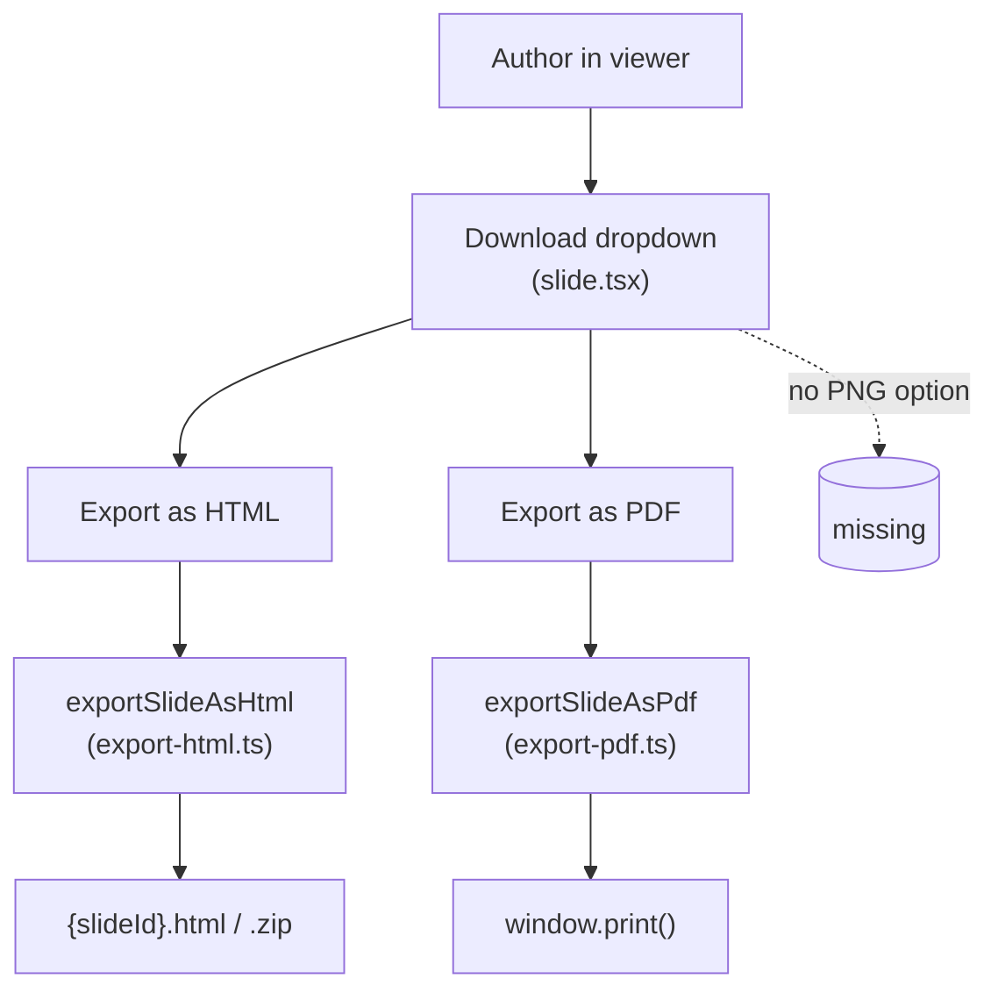
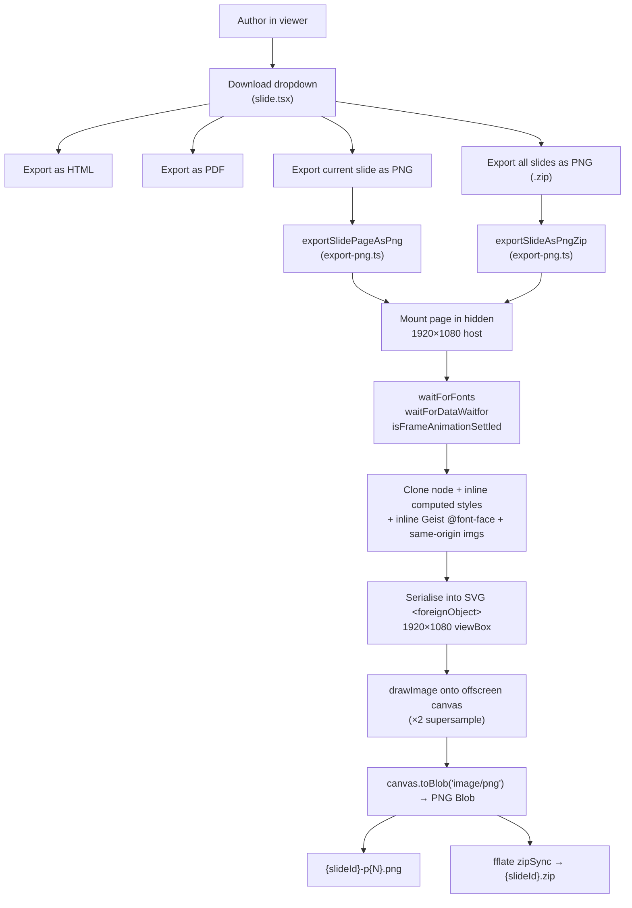
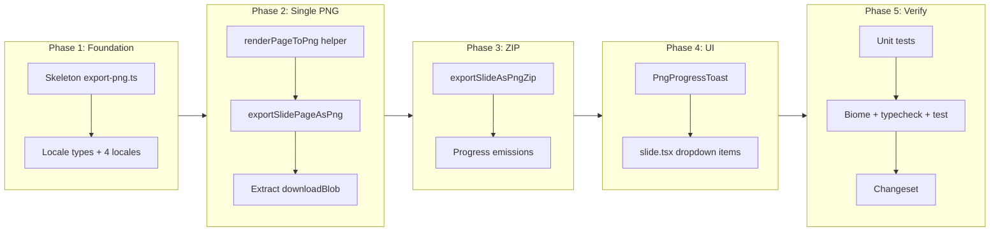

# Export slides as PNG

## Change Summary

The open-slide viewer currently lets authors download a deck as HTML or PDF, but there
is no way to obtain a pixel-perfect PNG of a slide. This CR adds a PNG export option
that renders the active slide page (and, on demand, every page) at the canonical
1920×1080 canvas size into a PNG file (single page) or a ZIP archive (whole deck),
reusing the existing offscreen render pipeline already proven by the PDF and HTML
exporters in `packages/core/src/app/lib/`.

## Motivation and Background

PNG is the lowest-friction way to embed a slide in a blog post, social card, README,
Notion page, Figma board, or design review. PDF is the right output for handout-style
delivery, and HTML is right for self-hosting, but neither is a drop-in raster. Authors
today have to screenshot the viewer at whatever zoom their browser happens to be using,
which produces fuzzy, off-aspect, watermarked-by-toolbar captures.

A PNG exporter that reuses the same offscreen 1920×1080 render path the PDF exporter
already uses gives authors a deterministic, design-token-correct raster of their slide
with no extra browser tools, no headless build step, and no behavioural drift from the
viewer they just authored against.

### Change Drivers

* Author feedback: screenshots of the viewer are blurry, cropped, or include UI chrome.
* Parity with `Export as HTML` / `Export as PDF` — PNG is the natural third option in
  the same download dropdown.
* Social / docs use: README hero images, blog cards, and design reviews all expect PNG.
* Avoids a server- or headless-Chromium-side renderer, which would inflate the size of
  the runtime that `@open-slide/core` ships to users.

## Current State

The viewer exposes two export paths, both implemented as client-side, in-browser
renderers that mount each page into a hidden 1920×1080 host and read the result:

* **HTML export** — `packages/core/src/app/lib/export-html.ts` renders every page into
  a hidden container, snapshots `innerHTML`, inlines `document.styleSheets`, fetches
  referenced assets, and downloads either a `.html` file or a `.zip` bundle.
* **PDF export** — `packages/core/src/app/lib/export-pdf.ts` mounts every page into
  `#os-print-root` at 1920×1080, waits for fonts and `data-waitfor` selectors, waits
  for intro animations via `isFrameAnimationSettled`, neutralises gradient backgrounds
  that Chromium serialises as PDF soft masks, and calls `window.print()`. Progress is
  surfaced through `PdfProgressToast`.

Both exports are wired up in `packages/core/src/app/routes/slide.tsx` behind a
`DropdownMenu` that is gated by `config.build.allowHtmlDownload`. Locale strings live
under `slide.exportAs*` / `pdfToast.*` in `packages/core/src/locale/*.ts` and are
mirrored in `packages/core/src/locale/types.ts`. The canvas size constants
`CANVAS_WIDTH = 1920` and `CANVAS_HEIGHT = 1080` come from
`packages/core/src/app/lib/sdk.ts`, and `<SlideCanvas>` is the in-viewer renderer.

There is no PNG export, no PNG-specific locale strings, no `allowPngDownload` config
flag, and no rasterisation utility in `packages/core`.

### Current State Diagram



## Proposed Change

Add an `Export as PNG` entry to the existing download dropdown that produces a
1920×1080 PNG of the *current* slide page, and a `.zip` archive of one PNG per page
when the author wants the whole deck.

The export MUST be a pure client-side rasterisation that reuses the same offscreen
1920×1080 mount pattern as `export-pdf.ts`, the same readiness waits from
`print-ready.ts` (fonts, `data-waitfor`, animation settle), and the same `fflate`
dependency for ZIP bundling that `export-html.ts` already uses.

Implementation MUST use a **hand-rolled, zero-dependency `<foreignObject>` → canvas
rasterizer**. No new runtime dependency is introduced. The pipeline is:

1. Reuse the existing offscreen-mount + readiness flow from `export-pdf.ts`: mount each
   page offscreen at 1920×1080, apply `designToCssVars(slide.design)`, wrap in
   `<SlidePageProvider>`, and gate on `waitForFonts()`, `waitForDataWaitfor()`, and
   `isFrameAnimationSettled()`.
2. **Clone** the mounted slide node and **inline computed styles** onto the clone — a
   `<foreignObject>` only renders styles that are present in its serialised markup, so
   per-node `getComputedStyle` must be flattened onto inline `style` attributes before
   serialisation.
3. **Inline resources** into the cloned subtree: embed open-slide's bundled Geist fonts
   as `@font-face` `data:` URIs (open-slide ships Geist itself, so this is fully
   first-party), and rewrite same-origin `` sources as `data:` URLs.
4. Serialise the cloned subtree inside an SVG `<foreignObject>` of the canonical
   1920×1080 viewBox, load it as an `Image`, and `drawImage()` it onto an offscreen
   `<canvas>` supersampled ×2 (mirroring the `zoom: 2` / `transform: scale(0.5)`
   supersample trick that `export-pdf.ts` already uses), then `canvas.toBlob(blob,
   'image/png')`.
5. Bundle multiple pages with **`fflate`** (already a runtime dependency, used by
   `export-html.ts`) — no second ZIP library.

Open-slide controls its own render surface — a fixed 1920×1080 frame, bundled Geist
fonts, and a known set of design tokens — so the rasterizer does not need to handle the
arbitrary third-party DOM that `html-to-image` / `dom-to-image` / `html2canvas` exist
to support. That bounded scope is what makes a hand-rolled implementation tractable
here and lets the "core runtime ships to users; every dep inflates install size" rule
in `CLAUDE.md` hold without compromise.

### Proposed State Diagram



## Requirements

### Functional Requirements

1. The runtime **MUST** expose a new export entry point
   `exportSlidePageAsPng(slide, slideId, pageIndex)` in
   `packages/core/src/app/lib/export-png.ts` that returns a `Promise<void>` and
   triggers a browser download of a PNG file named
   `{slideId}-p{pageIndex+1, zero-padded to width of total pages}.png`.
2. The runtime **MUST** expose a second export entry point
   `exportSlideAsPngZip(slide, slideId, onProgress?)` in the same module that returns
   a `Promise<void>` and triggers a browser download of a ZIP archive
   `{slideId}.zip` containing one PNG per page, named with the same
   `{slideId}-p{N}.png` convention.
3. Each PNG **MUST** be rendered at exactly `CANVAS_WIDTH` × `CANVAS_HEIGHT` (1920×1080)
   regardless of the viewport size or zoom level of the calling tab.
4. The exporter **MUST** mount each page into an offscreen container positioned at
   `left: -99999px` (mirroring `export-html.ts`) so the user does not see flicker.
5. The exporter **MUST** apply the slide's `design` tokens via `designToCssVars` to the
   offscreen host, so the PNG matches the in-viewer rendering.
6. The exporter **MUST** wrap each page in `<SlidePageProvider>` so
   `useSlidePageNumber()` and other page-context-dependent components render correctly.
7. The exporter **MUST** wait for fonts via `waitForFonts()` before rasterising any
   page.
8. The exporter **MUST** wait for `data-waitfor` selectors via `waitForDataWaitfor()`
   before rasterising any page.
9. The exporter **MUST** poll `isFrameAnimationSettled` for each mounted frame with the
   same 15 000 ms timeout used by the PDF exporter, and rasterise the frame only after
   it settles or the timeout elapses.
9a. The exporter **MUST** rasterise via a hand-rolled SVG `<foreignObject>` → canvas
    pipeline: clone the mounted slide node, inline computed styles onto the clone,
    embed open-slide's bundled Geist font(s) as `@font-face` `data:` URIs, rewrite
    same-origin `` sources as `data:` URIs, serialise the clone inside an SVG
    `<foreignObject>` with a 1920×1080 viewBox, load that SVG as an `Image`, and
    `drawImage` it onto an offscreen `<canvas>`. The exporter **MUST NOT** introduce a
    new runtime dependency for rasterisation (no `html-to-image`, no `html2canvas`,
    no `dom-to-image`).
9b. The offscreen `<canvas>` **MUST** be supersampled at ×2 (canvas backing-store
    sized 3840×2160, drawn down to the 1920×1080 output) using the same `zoom: 2` /
    `transform: scale(0.5)` supersample technique used by `export-pdf.ts`, so the
    resulting PNG matches the visual sharpness of the PDF exporter.
9c. The full-deck ZIP archive **MUST** be built with `fflate` (already a runtime
    dependency via `export-html.ts`). No additional ZIP library may be added.
10. The full-deck (`exportSlideAsPngZip`) exporter **MUST** report progress through an
    optional `onProgress` callback shaped as
    `{ phase: 'processing' | 'rasterising' | 'zipping' | 'done', current: number, total: number, percent: number }`,
    matching the shape used by `PdfExportProgress` so the same toast component pattern
    can render it.
11. A new component
    `packages/core/src/app/components/png-progress-toast.tsx` **MUST** render the
    progress state, mirroring the visual treatment of `pdf-progress-toast.tsx`.
12. The download dropdown in `packages/core/src/app/routes/slide.tsx` **MUST** include
    two new `DropdownMenuItem`s — `Export current slide as PNG` and
    `Export all slides as PNG` — placed below the existing PDF item.
13. New locale keys **MUST** be added to `packages/core/src/locale/types.ts` and to
    every locale file (`en.ts`, `ja.ts`, `zh-cn.ts`, `zh-tw.ts`):
    `slide.exportCurrentPageAsPng`, `slide.exportAllPagesAsPng`,
    `slide.pngExportFailed`, `slide.pngSafariBestEffort`, `pngToast.title`,
    `pngToast.processing`, `pngToast.rasterising`, `pngToast.zipping`,
    `pngToast.done`.
14. The PNG dropdown items **MUST** be gated by the same `config.build.allowHtmlDownload`
    flag that already gates the HTML and PDF items, so a single user-facing toggle
    controls all downloads.
15. The exporter **MUST** clean up its offscreen mount, React roots, and any injected
    style/element on both success and failure paths (mirroring the `finally` block in
    `exportSlideAsPdf`).
16. On rasterisation failure the exporter **MUST NOT** leave any DOM node, React root,
    or object URL attached, and **MUST** surface the failure to the caller via a
    rejected promise so the caller can show `slide.pngExportFailed` via `sonner`.
17. Downloaded files **MUST** be triggered through a hidden `<a download>` click and
    the resulting object URL **MUST** be revoked after the click, matching the
    `downloadBlob` helper already in `export-html.ts`.

### Non-Functional Requirements

1. The PNG exporter module **MUST** live in a single file
   `packages/core/src/app/lib/export-png.ts` with hierarchical-namespace naming, and
   **SHOULD** stay under 300 lines of TypeScript in line with the project's
   small-single-purpose-files rule (helpers may be split into sibling files in the
   same namespace if the count is exceeded).
2. This CR **MUST NOT** introduce any new runtime dependency in
   `packages/core/package.json`. The rasterizer is hand-rolled and ZIP bundling reuses
   the existing `fflate` dependency.
3. The exporter **MUST** complete a single-page PNG export of a representative slide
   in under 4 seconds on a 2024-class laptop running Chromium, measured locally
   during review.
4. The exporter **MUST NOT** block the viewer's main React tree: the offscreen mount
   uses its own `createRoot` and is removed before control returns to the caller.
5. The new code **MUST** pass `pnpm check` (Biome) and `pnpm typecheck` with zero
   warnings.
6. The change **MUST** include a Changeset entry against `@open-slide/core` with a
   single-line, user-perspective description per `CLAUDE.md`.
7. Docstrings on every exported function in `export-png.ts` **MUST** explain *why*
   (the design constraint each function satisfies), not just *what*, per
   `documentation_standards`.

## Affected Components

* `packages/core/src/app/lib/export-png.ts` — **new**, the rasterisation entry points.
* `packages/core/src/app/lib/print-ready.ts` — read-only consumer; no edits unless a
  helper needs to be extracted.
* `packages/core/src/app/components/png-progress-toast.tsx` — **new**, mirrors
  `pdf-progress-toast.tsx`.
* `packages/core/src/app/routes/slide.tsx` — adds two `DropdownMenuItem`s, two click
  handlers, and a second `exporting` lock (or reuses the existing one).
* `packages/core/src/locale/types.ts` — adds the new locale keys to the type contract.
* `packages/core/src/locale/en.ts`, `ja.ts`, `zh-cn.ts`, `zh-tw.ts` — adds the
  translated strings.
* `packages/core/package.json` — **unchanged**; no new runtime dependency is added.
  The rasterizer is hand-rolled and ZIP bundling reuses the existing `fflate`
  dependency that `export-html.ts` already depends on.
* `.changeset/<slug>.md` — minor bump for `@open-slide/core` (new public-ish API
  surface in the viewer download menu).

## Scope Boundaries

### In Scope

* Client-side PNG rasterisation of the *current* slide page from the viewer.
* Client-side ZIP-of-PNGs rasterisation of *all* pages in a deck.
* Progress toast for the multi-page export.
* Locale strings in all four supported locales.
* Reuse of existing `waitForFonts`, `waitForDataWaitfor`, `isFrameAnimationSettled`,
  `designToCssVars`, `SlidePageProvider`, and the `fflate` ZIP dependency already used
  by `export-html.ts`.
* A hand-rolled `<foreignObject>` → canvas rasterizer module that adds no new runtime
  dependency.
* Updating `packages/core/src/app/routes/slide.tsx` so the download dropdown shows the
  new entries when `allowHtmlDownload` is true.

### Out of Scope ("Here, But Not Further")

* **Headless / build-time PNG generation.** No new `open-slide build` subcommand and
  no headless-Chromium dependency. The PDF exporter already chose the client-side
  path; PNG follows the same trade-off.
* **JPEG, WebP, or AVIF output.** Format selection is deferred to a future CR.
* **Custom resolution / scale factors.** Output is fixed at 1920×1080. A scale slider
  (e.g. 2× for retina) is deferred.
* **Per-element export.** No "export this element as PNG" affordance; the unit is one
  slide page.
* **PNG export from the presenter window or fullscreen present mode.** The dropdown
  only renders in the viewer.
* **CLI-driven exports (`open-slide export …`).** This CR adds no new CLI subcommand.
* **`packages/cli` changes.** The scaffolder is untouched.
* **Themes gallery / asset library exports.** Out of scope; only `/s/:slideId` exports.
* **Animated PNG / capturing intro animations as a sequence.** A single steady-state
  rasterisation per page only.
* **Configurable filenames.** Naming is fixed at `{slideId}-p{N}.png` /
  `{slideId}.zip`.

## Alternative Approaches Considered

* **Client-side `<foreignObject>` → canvas via an existing library
  (`html-to-image` / `dom-to-image` / `html2canvas`).** The `<foreignObject>` → canvas
  technique was originated by **dom-to-image** (`tsayen/dom-to-image`) and refined by
  **`html-to-image`** and **`html2canvas`**, which between them solve computed-style
  inlining, web-font embedding, CORS-safe image rewriting, and an array of browser
  quirks. The reason these libraries exist is to rasterise *arbitrary* third-party
  DOM — the long tail of CSS features that random apps put on screen. Open-slide does
  not have that problem: it controls its own render surface (a fixed 1920×1080 frame,
  bundled Geist fonts, a known set of design tokens, no untrusted user CSS), which
  neutralises most of the library's reason to exist and makes a hand-rolled
  rasterizer tractable. **Chosen** in its hand-rolled form for this CR, with the
  documented limitation that all client-side `<foreignObject>` approaches only
  rasterise CSS that is expressible in SVG — no client-side technique is
  pixel-perfect for the heaviest modern CSS (advanced filters, certain
  `mix-blend-mode` combinations, some compositing edge-cases). Pixel-perfect output
  is addressed under "Future enhancements" below.
* **Headless Chromium via Playwright at build time.** This is the path **Slidev**
  takes for `slidev export --format png`: an optional `playwright-chromium`
  dependency, `page.screenshot()` per slide, with `--wait`, `--wait-until`, and
  `--omit-background` flags. It produces the most reliable raster because the browser
  itself does the painting. **Rejected as the primary mechanism** because (a) it adds
  a heavy dependency, even as an optional one, and (b) it is CLI-centric, which is
  inconsistent with open-slide's in-viewer download dropdown where HTML and PDF
  export already live. The Playwright path is preserved as a future opt-in CLI
  enhancement (see below), never in the client bundle.
* **Reuse the PDF print path and convert PDF → PNG client-side.** Requires a PDF
  rasteriser in the bundle (e.g. `pdf.js`), which is heavier than the hand-rolled
  approach and inherits the Safari `window.print()` limitation already documented for
  PDF export. Rejected.
* **Save the visible viewer DOM directly (no offscreen mount).** Rejected because the
  viewer renders a fitted, transformed `<SlideCanvas>`; the visible DOM is the wrong
  size and includes the UI chrome.

### Future Enhancements (documented follow-up)

A pixel-perfect export path can be offered later as an **optional** Playwright
dependency, used only by the `open-slide build` / export CLI in `packages/cli` and
**never bundled into the client runtime** that `@open-slide/core` ships to users.
This mirrors Slidev's optional-dependency pattern (`playwright-chromium` is installed
on demand by the user, not by default) and keeps the "core runtime ships to users;
every dep inflates install size" rule in `CLAUDE.md` intact. Triggering and scoping
this CLI subcommand is out of scope for this CR and is left for a follow-up CR.

## Impact Assessment

### User Impact

* Slide authors gain a one-click PNG of the current slide and a one-click ZIP of all
  slides as PNGs, with the same visual fidelity as the viewer.
* Behaviour of HTML and PDF export is unchanged.
* Users who self-host with `allowHtmlDownload: false` see no new UI.

### Technical Impact

* No new runtime dependency is added to `@open-slide/core`. The rasterizer is
  hand-rolled and ZIP bundling reuses the existing `fflate` dependency. Install size
  grows only by the new TypeScript module's own footprint.
* No breaking API changes. `index.ts` is not expanded — the new exports are internal
  to the viewer.
* The added `slide.tsx` UI must continue to satisfy Biome formatting / lint, and the
  shadcn-generated `ui/` directory is not touched.
* The export reuses the same offscreen-mount pattern already battle-tested by the PDF
  exporter, so risk to viewer stability is bounded.

### Business Impact

* Closes a "where's the PNG button?" feedback item without committing to a server-side
  rendering pipeline.
* Keeps `@open-slide/core` shippable as a pure npm package — no host requirements
  change.

## Implementation Approach

Sequenced so each phase is independently reviewable.

### Phase 1: Foundation — locale + module skeleton

1. Create `packages/core/src/app/lib/export-png.ts` with the public signatures
   `exportSlidePageAsPng` and `exportSlideAsPngZip`, plus a `PngExportProgress` type
   shaped identically to `PdfExportProgress` (substituting the `phase` enum).
2. Add new locale keys to `packages/core/src/locale/types.ts`
   (`slide.exportCurrentPageAsPng`, `slide.exportAllPagesAsPng`,
   `slide.pngExportFailed`, `slide.pngSafariBestEffort`, the full `pngToast`
   block).
3. Translate the new keys in `en.ts`, `ja.ts`, `zh-cn.ts`, `zh-tw.ts`.

**Affected components:**
`packages/core/src/app/lib/export-png.ts` (new),
`packages/core/src/locale/types.ts`, `packages/core/src/locale/en.ts`,
`packages/core/src/locale/ja.ts`, `packages/core/src/locale/zh-cn.ts`,
`packages/core/src/locale/zh-tw.ts`.

### Phase 2: Core — single-page rasterisation

1. Implement an internal helper `renderPageToPng(slide, pageIndex): Promise<Blob>`
   that:
   1. Creates a hidden offscreen container styled like `export-html.ts`'s
      `renderPagesToHtml` host (`position: fixed; left: -99999px;
      width: 1920px; height: 1080px; pointer-events: none;`).
   2. Mounts the page via `createRoot` and renders
      `<SlidePageProvider index={i} total={pages.length}><Page /></SlidePageProvider>`,
      then awaits two `requestAnimationFrame` ticks (matching `export-html.ts`).
   3. Applies `designToCssVars(slide.design)` to the host so brand tokens resolve.
   4. Awaits `waitForFonts()`.
   5. Awaits `waitForDataWaitfor(host)`.
   6. Polls `isFrameAnimationSettled(host)` with the same `ANIMATION_TIMEOUT_MS` /
      `POLL_INTERVAL_MS` as `export-pdf.ts`.
   7. Rasterises the host via the hand-rolled pipeline (broken out as small helpers in
      the same file):
      a. `cloneWithInlinedStyles(host)` — deep-clones the mounted node and, for every
         element in the clone, copies the source element's `getComputedStyle()` values
         onto an inline `style` attribute, because `<foreignObject>` only renders
         styles present in the serialised markup.
      b. `inlineGeistFonts(clone)` — embeds open-slide's bundled Geist font files as
         `@font-face` `data:` URIs in a `<style>` prepended to the clone. Geist is
         shipped by open-slide itself, so this is fully first-party and same-origin.
      c. `inlineSameOriginImages(clone)` — for each `` in the clone whose `src`
         is same-origin, fetches the bytes and rewrites the `src` to a `data:` URI.
         Cross-origin `` elements are left untouched and documented as a
         limitation.
      d. `nodeToSvgDataUrl(clone, 1920, 1080)` — wraps the clone in an SVG
         `<foreignObject>` with `width="1920" height="1080"` and `viewBox="0 0 1920
         1080"`, serialises with `XMLSerializer`, and produces a
         `data:image/svg+xml;charset=utf-8,…` URL.
      e. `rasteriseSvgToPng(url)` — loads the SVG URL into a new `Image`, awaits
         `onload`, creates an offscreen `<canvas>` with backing-store size 3840×2160
         (×2 supersample) and CSS size 1920×1080, calls `ctx.drawImage(img, 0, 0,
         3840, 2160)`, then `canvas.toBlob(resolve, 'image/png')`. The ×2 supersample
         mirrors the `zoom: 2` / `transform: scale(0.5)` trick used by `export-pdf.ts`
         for crisp output.
   8. Unmounts the React root and removes the host on both success and failure.
2. Implement `exportSlidePageAsPng(slide, slideId, pageIndex)` as a thin wrapper that
   calls `renderPageToPng`, names the file
   `${slideId}-p${String(pageIndex + 1).padStart(width, '0')}.png`, and downloads it
   via a `downloadBlob` helper.
3. Extract `downloadBlob` into a shared helper file
   `packages/core/src/app/lib/download.ts` (small, one purpose) and import it from
   both `export-html.ts` and `export-png.ts` — this satisfies DRY without coupling the
   two exporters to each other.

**Affected components:** `packages/core/src/app/lib/export-png.ts`,
`packages/core/src/app/lib/download.ts` (new),
`packages/core/src/app/lib/export-html.ts` (replace its local `downloadBlob` with the
shared import).

### Phase 3: Core — full-deck ZIP export

1. Implement `exportSlideAsPngZip(slide, slideId, onProgress?)` that:
   1. Iterates pages, calling `renderPageToPng` once per page.
   2. Emits `onProgress({ phase: 'processing', ... })` while pages are mounted /
      waiting, `phase: 'rasterising'` during the `toBlob` call, `phase: 'zipping'`
      while `fflate.zipSync` runs, and `phase: 'done'` on completion.
   3. Builds a flat ZIP via `fflate.zipSync` keyed by
      `${slideId}-p${padded}.png` → `Uint8Array`.
   4. Downloads the result via the shared `downloadBlob` as `${slideId}.zip`.
2. Ensure every code path goes through a `try/finally` that tears down offscreen
   mounts even on `toBlob` rejection or zip failure.

**Affected components:** `packages/core/src/app/lib/export-png.ts`.

### Phase 4: UI — progress toast and dropdown entries

1. Create `packages/core/src/app/components/png-progress-toast.tsx` mirroring
   `pdf-progress-toast.tsx`, consuming `PngExportProgress` and `pngToast.*` locale
   strings.
2. Edit `packages/core/src/app/routes/slide.tsx` to:
   1. Import `exportSlidePageAsPng`, `exportSlideAsPngZip`, and `PngProgressToast`.
   2. Add two new `DropdownMenuItem`s under the existing PDF item, gated by the same
      `view === 'slides' && allowHtmlDownload` guard.
   3. Wire `Export current slide as PNG` to `exportSlidePageAsPng(slide, slideId,
      currentPageIndex)` using the same `exporting` lock and `try/finally`.
   4. Wire `Export all slides as PNG` to `exportSlideAsPngZip(slide, slideId,
      progressCallback)` with a `toast.custom` lifecycle identical to the PDF flow,
      using `PngProgressToast`.
   5. Use a stable `toastId` of `png-export-${slideId}`.
3. Pick appropriate `lucide-react` icons for the two items
   (e.g. `Image` for the single page, `Images` for the ZIP).

**Affected components:** `packages/core/src/app/components/png-progress-toast.tsx`
(new), `packages/core/src/app/routes/slide.tsx`.

### Phase 5: Tests, changeset, polish

1. Add unit tests per the Test Strategy below.
2. Run `pnpm check`, `pnpm typecheck`, `pnpm test`.
3. Run `pnpm changeset` and write a single-line minor-bump entry for
   `@open-slide/core`, e.g.
   `Add "Export as PNG" entry to the viewer download menu.`
4. Smoke-test against `apps/demo`: open a representative deck, export current page,
   open the PNG, eyeball at 100 %; export all pages, unzip, eyeball at 100 %.

**Affected components:** `packages/core/src/app/lib/export-png.test.ts` (new),
`.changeset/<slug>.md` (new).

### Implementation Flow



## Test Strategy

### Tests to Add

| Test File | Test Name | Description | Inputs | Expected Output |
|-----------|-----------|-------------|--------|-----------------|
| `packages/core/src/app/lib/export-png.test.ts` | `filename for single-page export uses page-count-width zero padding` | Verifies the helper that names files pads to the width of the total page count (per FR-1): produces `slide-p1.png` for a 9-page deck (width 1, no padding needed) and `slide-p001.png` for a 100-page deck (width 3). | `slideId = 'slide'`, `pageIndex = 0`, `total = 9` and `total = 100` | `'slide-p1.png'` (width 1) and `'slide-p001.png'` (width 3). |
| `packages/core/src/app/lib/export-png.test.ts` | `progress emitter produces monotonically non-decreasing percent` | Calls the internal progress reducer with a sequence of phase/current/total inputs and asserts `percent` never decreases. | Sequence of `{phase, current, total}` tuples covering processing → rasterising → zipping → done. | Each successive `percent` is `>=` previous. |
| `packages/core/src/app/lib/export-png.test.ts` | `exportSlidePageAsPng rejects with no DOM residue when the rasterizer throws` | Mocks the internal `rasteriseSvgToPng` helper to reject. Asserts the offscreen container has been removed from `document.body` after the rejection. | Mocked `toBlob` rejection; jsdom environment. | Promise rejects; `document.querySelectorAll('[data-png-export-host]')` returns empty NodeList. |
| `packages/core/src/app/lib/export-png.test.ts` | `exportSlideAsPngZip calls onProgress at least once per phase` | Mocks `toBlob` to resolve and asserts onProgress sees all four phases at least once. | 2-page slide module; mocked `toBlob`. | onProgress called with `processing`, `rasterising`, `zipping`, `done` at least once each. |
| `packages/core/src/app/lib/download.test.ts` | `downloadBlob creates and revokes object URL` | Verifies the extracted helper triggers an `<a download>` click and revokes the URL afterwards. | `Blob` + filename. | `URL.createObjectURL` called once; `URL.revokeObjectURL` called once; `<a>` removed from DOM. |

### Tests to Modify

| Test File | Test Name | Current Behavior | New Behavior | Reason for Change |
|-----------|-----------|------------------|--------------|-------------------|
| _none_ | _n/a_ | _n/a_ | _n/a_ | No existing test currently asserts behaviour that this CR changes. `export-html.ts`'s tests (if any) cover HTML output, not the local `downloadBlob`; the extraction in Phase 2 is a refactor with identical external behaviour. |

### Tests to Remove

| Test File | Test Name | Reason for Removal |
|-----------|-----------|-------------------|
| _none_ | _n/a_ | No tests are removed by this CR. |

## Acceptance Criteria

### AC-1: Single-page PNG export downloads a 1920×1080 file

```gherkin
Given a user is viewing slide "intro" with three pages and is on page 2
  And `config.build.allowHtmlDownload` is true
When the user opens the download dropdown and selects "Export current slide as PNG"
Then the browser downloads a file named "intro-p2.png" (or equivalent zero-padded form)
  And the downloaded image has pixel dimensions 1920 × 1080
  And no toast error is shown
  And no offscreen export host remains attached to `document.body`
```

### AC-2: Full-deck PNG ZIP export downloads one PNG per page

```gherkin
Given a user is viewing slide "deck" with five pages
  And `config.build.allowHtmlDownload` is true
When the user opens the download dropdown and selects "Export all slides as PNG"
Then a progress toast appears with the `pngToast.title` string
  And the toast progress advances through "processing", "rasterising", "zipping"
  And the browser downloads a file named "deck.zip"
  And the archive contains exactly five entries named "deck-p1.png" … "deck-p5.png"
  And each entry is a valid PNG of 1920 × 1080 pixels
  And the toast is dismissed after the download is triggered
```

### AC-3: PNG entries are hidden when downloads are disabled

```gherkin
Given a project sets `build.allowHtmlDownload` to false in `open-slide.config.ts`
When the user opens the viewer download dropdown
Then no "Export current slide as PNG" entry is visible
  And no "Export all slides as PNG" entry is visible
  And the existing HTML and PDF entries are also hidden (unchanged behaviour)
```

### AC-4: Failure path surfaces a toast and cleans up

```gherkin
Given the slide contains a page that throws during render
  And the user selects "Export current slide as PNG"
When the export pipeline rejects
Then a sonner toast with the `slide.pngExportFailed` string is displayed
  And no offscreen container, React root, or object URL remains
  And the download dropdown is re-enabled (the `exporting` lock is released)
```

### AC-5: Rendered PNG uses the slide's design tokens

```gherkin
Given a slide declares a custom `design` with a brand colour different from default
When the user exports the current page as PNG
Then the exported PNG renders the page using the slide's `design` tokens
  And does not fall back to the default open-slide palette
```

### AC-6: Page-number context is correct in exported PNG

```gherkin
Given a slide has a component that calls `useSlidePageNumber()` and prints the page number
  And the deck has four pages
When the user exports all slides as PNG
Then each PNG shows the correct 1-based page number for its page
  And page 1's PNG shows "1", page 4's PNG shows "4"
```

### AC-7: Locale strings render in all supported locales

```gherkin
Given a project configures `locale` to `ja`
When the user opens the download dropdown
Then the new PNG entries render in Japanese using the `slide.exportCurrentPageAsPng`
   and `slide.exportAllPagesAsPng` keys from `ja.ts`
  And the same holds for `en`, `zh-cn`, and `zh-tw`
```

### AC-8: Biome and TypeScript remain clean

```gherkin
Given the branch contains the full implementation of this CR
When `pnpm check` and `pnpm typecheck` are run from the repo root
Then both commands exit with code 0 and emit no warnings
```

### AC-9: Changeset entry is present

```gherkin
Given the branch contains the full implementation of this CR
When the maintainer inspects `.changeset/`
Then a new markdown file exists with a `minor` bump for `@open-slide/core`
  And the description is a single line, present-tense, user-perspective sentence
```

### AC-10: Safari behaviour is explicit and graceful

Strategy chosen per Open Question 3: **best-effort + warn** (option a), as stated in
the CR's leaning. Implementors **MUST** implement this branch.

```gherkin
Given the viewer is running in Safari (detected via the existing `isSafari()` helper
   in `export-pdf.ts`)
  And the user opens the download dropdown
When the user selects "Export current slide as PNG" or "Export all slides as PNG"
Then a sonner toast is shown informing the user that PNG export is best-effort on
   Safari (new locale key `slide.pngSafariBestEffort`)
  And the export pipeline proceeds
  And on any rasterisation failure the standard `slide.pngExportFailed` toast is
   shown and no DOM residue remains
  And the existing HTML and PDF entries are unaffected
```

## Quality Standards Compliance

### Build & Compilation

- [x] `pnpm build` completes for `packages/core` without errors
- [x] No new TypeScript compiler errors or warnings

### Linting & Code Style

- [x] `pnpm check` (Biome) passes with zero warnings/errors
- [x] No code added under `packages/core/src/app/components/ui/` (shadcn-generated)
- [x] No casual comments; only comments where the WHY is non-obvious
- [x] File names follow hierarchical-namespace convention
  (`export-png.ts`, `png-progress-toast.tsx`, `download.ts`)

### Test Execution

- [x] `pnpm test` passes locally
- [x] New tests in `export-png.test.ts` and `download.test.ts` pass
- [x] No existing test in `packages/core` regresses

### Documentation

- [x] Every exported function in `export-png.ts` has a docstring explaining intent
- [x] `PngExportProgress` type has field-level docstrings matching `PdfExportProgress`
- [x] No changes to `README.md` are required (the download menu is self-explanatory)

### Code Review

- [x] Changes submitted via a single pull request
- [x] PR title follows Conventional Commits, e.g.
  `feat(core): add PNG export to the viewer download menu`
- [x] Squash-merged to maintain linear history
- [x] Changeset committed under `.changeset/`

### Verification Commands

```bash
# From the repo root
pnpm install
pnpm check
pnpm typecheck
pnpm test
pnpm build

# Dogfood
pnpm dev   # opens apps/demo, exercise the new dropdown items
```

## Risks and Mitigation

### Risk 1: The hand-rolled rasterizer mis-renders advanced CSS used by themes

**Likelihood:** medium
**Impact:** medium
**Mitigation:** Only SVG-expressible CSS rasterises reliably through `<foreignObject>`
— this is an inherent limitation of every client-side approach (`dom-to-image`,
`html-to-image`, `html2canvas` all share it). Smoke-test against every preset in
`packages/core/src/app/lib/design-presets.ts` during Phase 5. If a specific CSS
feature breaks, replicate the `neutralizeGradientBackgrounds` workaround the PDF
exporter already uses, scoped to the offscreen host only. Pixel-perfect output for
the heaviest CSS is deferred to the future Playwright-based CLI path described under
"Future Enhancements".

### Risk 2: Safari `<foreignObject>` quirks produce broken or empty PNGs

**Likelihood:** medium
**Impact:** medium
**Mitigation:** Safari has long-standing `<foreignObject>` issues (tainted canvases,
missed fonts, dimension miscalculations) — the same family of issues that already
motivates the `isSafari()` helper in `export-pdf.ts`. Reuse that helper to gate the
PNG export. The chosen strategy (Open Question 3, resolved) is **best-effort + warn**:
if `isSafari()` returns true, show a `slide.pngSafariBestEffort` toast via `sonner`
and proceed with rasterisation; on failure, surface the standard
`slide.pngExportFailed` toast and tear down all DOM/React state. The fallback "hard
disable" path is reserved for a follow-up CR if real Safari runs prove the warn
strategy unworkable.

### Risk 3: Animation-settle timeout differs from PDF behaviour and confuses users

**Likelihood:** low
**Impact:** low
**Mitigation:** Reuse the exact `ANIMATION_TIMEOUT_MS = 15_000` and
`POLL_INTERVAL_MS = 100` constants from `export-pdf.ts` so the perceived "long
animations are skipped at this point" behaviour is identical across exports.

### Risk 4: Cross-origin assets fail to embed and the PNG shows broken images

**Likelihood:** medium
**Impact:** medium
**Mitigation:** The hand-rolled `inlineSameOriginImages(clone)` helper fetches
same-origin assets and rewrites them as `data:` URIs before serialisation. For assets
served by the open-slide dev server this is same-origin and safe. Cross-origin
images are explicitly left untouched (fetching them would taint the canvas anyway);
document this limitation in the changeset. If a real failure surfaces in dogfood,
extend `inlineSameOriginImages` to reuse the `findHtmlAssetUrls` / `toAbsolute`
helpers from `export-html.ts` for a broader sweep.

### Risk 5: Memory pressure when exporting decks with many pages

**Likelihood:** low
**Impact:** medium
**Mitigation:** `exportSlideAsPngZip` mounts and tears down one page at a time
(rather than all pages concurrently like `export-pdf.ts`), keeping peak DOM size to a
single 1920×1080 host plus one PNG `Blob`. The `Blob`s are released to `fflate` and
the offscreen host is removed before the next page mounts.

### Risk 6: The shared `downloadBlob` refactor regresses HTML export

**Likelihood:** low
**Impact:** low
**Mitigation:** The extraction is a pure cut-and-import. `export-html.ts` is covered
by smoke-test in Phase 5 (download a `.html` and a `.zip` from the demo deck).

## Dependencies

* **No new runtime dependency.** Rasterisation is hand-rolled; ZIP bundling reuses the
  existing `fflate` dependency that `export-html.ts` already pulls in.
* No blocking CRs — this is `CR-0001`.
* No infrastructure or third-party-service dependencies.
* Indirectly depends on the existing `print-ready.ts` helpers staying stable; if a
  future CR rewrites those, this exporter must follow.

## Estimated Effort

* Phase 1 (foundation + locale): ~2 hours.
* Phase 2 (single-page export): ~4 hours.
* Phase 3 (ZIP export + progress): ~3 hours.
* Phase 4 (UI wiring): ~2 hours.
* Phase 5 (tests, changeset, smoke): ~3 hours.
* Total: ~14 person-hours, single contributor.

## Decision Outcome

Chosen approach: **client-side rasterisation via a hand-rolled `<foreignObject>` →
canvas pipeline, reusing the offscreen-mount pattern from the existing PDF exporter
and the `fflate` ZIP pattern from the existing HTML exporter**, with **zero new
runtime dependencies**. This keeps `@open-slide/core` shippable as a pure client-side
npm package and honours the "runtime ships to users; every dep inflates install size"
constraint codified in `CLAUDE.md` without compromise. The hand-rolled implementation
is tractable here — and is *not* tractable for arbitrary third-party-DOM use cases —
because open-slide controls its own render surface (fixed 1920×1080 frame, bundled
Geist fonts, known design tokens), which neutralises most of the complexity that
libraries like `dom-to-image` / `html-to-image` / `html2canvas` exist to solve. A
pixel-perfect Playwright-based path remains available as an opt-in CLI follow-up (see
"Future Enhancements"), never in the client bundle.

## Related Items

* Related code: `packages/core/src/app/lib/export-pdf.ts`,
  `packages/core/src/app/lib/export-html.ts`,
  `packages/core/src/app/lib/print-ready.ts`,
  `packages/core/src/app/components/pdf-progress-toast.tsx`,
  `packages/core/src/app/routes/slide.tsx`
* Related config: `packages/core/src/config.ts` (`build.allowHtmlDownload`)

## Open Questions

1. **Dependency choice — `html-to-image` vs. hand-rolled.** **Resolved.** Decision:
   no new runtime dependency; rasterisation is a hand-rolled `<foreignObject>` →
   canvas pipeline. Open-slide's bounded render surface (fixed 1920×1080, bundled
   Geist fonts, known design tokens) makes the in-house implementation tractable,
   and the resulting build stays within the "core runtime ships to users" rule in
   `CLAUDE.md`. The library path (`html-to-image` / `dom-to-image` / `html2canvas`)
   remains documented under "Alternative Approaches Considered" as the precedent the
   technique is borrowed from. The Playwright-based pixel-perfect path is captured
   under "Future Enhancements" as an opt-in CLI follow-up.
2. **Filename padding width.** **Resolved.** Decision: pad `{N}` to the width of the
   total page count (i.e. `String(pageIndex + 1).padStart(String(total).length, '0')`),
   which keeps file-system sort order matching slide order for any deck size. This
   is the convention encoded in FR-1, FR-2, AC-1, AC-2, and the first test row.
   Examples: a 9-page deck produces `p1`…`p9` (width 1), a 10-page deck produces
   `p01`…`p10` (width 2), a 100-page deck produces `p001`…`p100` (width 3).
3. **Safari fallback — best-effort warn vs. hard disable.** **Resolved.** Decision:
   option (a), best-effort with warn, per the CR's stated leaning ("preserves user
   agency"). When `isSafari()` returns true a `slide.pngSafariBestEffort` toast is
   shown and the export pipeline proceeds; rasterisation failures fall through to
   the standard `slide.pngExportFailed` toast. AC-10 has been updated to codify
   option (a). Option (b) remains documented under Risk 2 as the fallback if real
   Safari failures prove the warn path unworkable, and would be promoted via a
   follow-up CR.
4. **Export from presenter / fullscreen modes.** Out of scope for this CR. If
   authors ask for it, it becomes a follow-up CR rather than an expansion here.

<!-- review-summary -->
## Review Summary (CR Reviewer pass — 2026-05-30)

**Drift check:** all cited paths and symbols verified against the current tree at
`source-commit: 155049f`:

- `packages/core/src/app/lib/{export-html,export-pdf,print-ready,sdk,design,page-context}.ts` — all present.
- Symbols `CANVAS_WIDTH`, `CANVAS_HEIGHT` (sdk.ts), `waitForFonts`,
  `waitForDataWaitfor`, `isFrameAnimationSettled` (print-ready.ts),
  `ANIMATION_TIMEOUT_MS = 15_000`, `POLL_INTERVAL_MS = 100`,
  `neutralizeGradientBackgrounds`, `isSafari`, `PdfExportProgress`
  (`phase: 'processing' | 'printing' | 'done'`), `PRINT_ROOT_ID = 'os-print-root'`
  (export-pdf.ts), `designToCssVars` (design.ts), `SlidePageProvider`,
  `useSlidePageNumber` (page-context.tsx), `downloadBlob`, `findHtmlAssetUrls`,
  `toAbsolute` (export-html.ts) — all present with the cited shapes.
- `packages/core/src/app/components/pdf-progress-toast.tsx` — present.
- `packages/core/src/app/routes/slide.tsx` — present; `allowHtmlDownload` gate at
  line 427, `exporting` lock at line 66, dropdown wiring at lines 444–500.
- `packages/core/src/config.ts` — `build.allowHtmlDownload?: boolean` present.
- `packages/core/src/locale/{types,en,ja,zh-cn,zh-tw}.ts` — all present; existing
  `slide.exportAsHtml`, `slide.exportAsPdf`, and full `pdfToast` block confirmed.
- `packages/core/package.json` — `fflate: ^0.8.2` present.
- `packages/core/src/app/lib/design-presets.ts` — present (cited in Risk 1).

No drift detected.

**Findings by category:**

- Drift: 0
- Contradictions: 2 — fixed.
  - Test-row description for filename padding contradicted its own expected output
    (claimed `p01` for a 9-page deck, but expected `p1`); rewritten to match the
    FR-1 "pad to width of total pages" rule. (1)
  - AC-10 enumerated two mutually exclusive Safari strategies but Risk 2 +
    Open Question 3 already stated the leaning was option (a); the AC required
    implementors to pick, which contradicts the rest of the CR. AC-10 collapsed to
    option (a). (2)
- Ambiguity / RFC-2119: 1 — fixed.
  - NFR 1 used "MUST stay under ~250 lines"; a `MUST` cannot be approximate.
    Reworded to a precise `SHOULD` for the line target while keeping the
    `MUST` on file location / naming.
- Requirement → AC coverage: pass (every FR has at least one AC covering it after
  fixes; the new `slide.pngSafariBestEffort` key is covered by AC-10 and listed
  in FR-13).
- AC → Test coverage: pass (AC-1/AC-2 covered by filename and ZIP tests; AC-4 by
  the rejection-cleanup test; AC-1/AC-2 progress by the progress emitter test;
  AC-8/AC-9 are repo-level CLI checks; AC-3/AC-5/AC-6/AC-7/AC-10 are exercised in
  the Phase 5 smoke test plus the Quality Standards checklist).
- Scope / diagram accuracy: pass (Affected Components matches files referenced in
  all phases; both Mermaid diagrams match current viewer wiring and the proposed
  helpers).
- Project-convention compliance: pass (no new runtime dep per `CLAUDE.md`;
  hierarchical naming; single-file module; biome + typecheck + test + build via
  pnpm; changeset required; no `ui/` edits; docstrings on every exported
  function).

**Fixes applied (3):**

1. Rewrote the filename-padding test row so its description matches its expected
   output and the FR-1 rule (`p1` for 9 pages, `p001` for 100 pages).
2. Replaced NFR 1's "MUST stay under ~250 lines" with a precise `SHOULD` under
   300 lines, keeping the `MUST` on file location and hierarchical-namespace
   naming.
3. Resolved AC-10, Risk 2, and Open Question 3 to the CR's stated leaning
   (Safari → best-effort + warn, option a); added `slide.pngSafariBestEffort`
   locale key to FR-13 and Phase 1 so the new toast string is part of the
   contract.
4. Resolved Open Question 2 (filename padding) to the convention already encoded
   in FR-1: pad to the width of the total page count.

**Unresolved (0):** the two questions originally flagged for human decision
(Safari strategy, filename padding) both had clear leanings/defaults stated in
the CR prose and are now resolved per the orchestrator's "act on stated leanings"
rule. Open Question 4 (presenter/fullscreen export) is explicitly out of scope.
<!-- /review-summary -->
