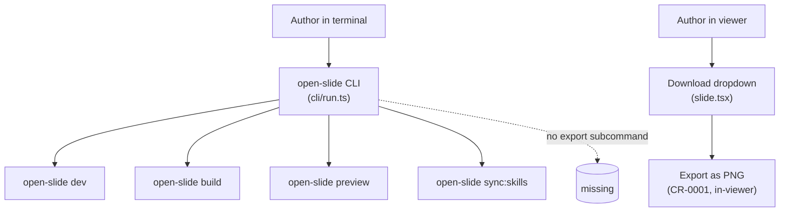
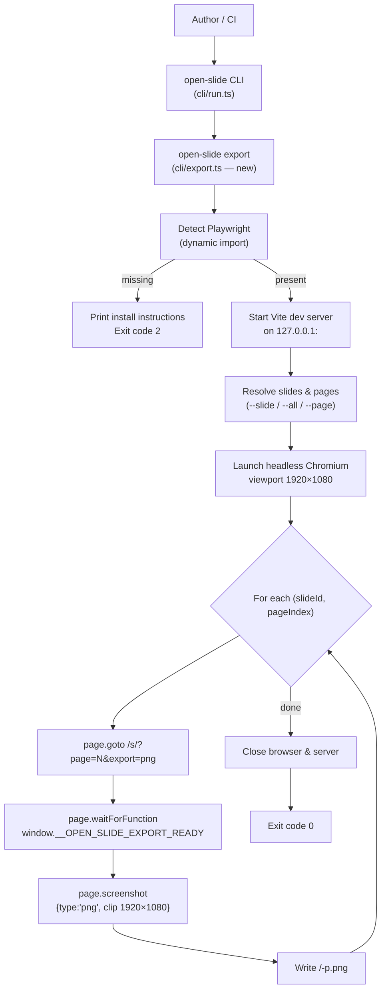
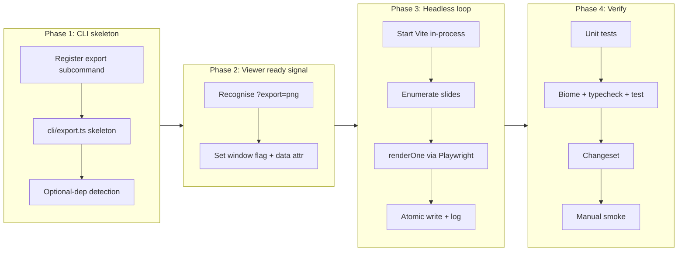

# Export slides as PNG from the CLI (headless)

## Change Summary

CR-0001 added a client-side, in-viewer PNG export driven by a hand-rolled
`<foreignObject>` → canvas rasterizer. This CR adds the second leg of PNG export:
a programmatic `open-slide export` subcommand that renders the same slides to PNG
files on disk **without any human browser interaction**, by booting the existing
dev/preview server, navigating a headless Chromium instance to the real viewer
route, awaiting the same readiness signals the in-viewer exporter uses, and
calling `page.screenshot()` once per page at the canonical 1920×1080 canvas size.

The render path is intentionally independent of CR-0001's client rasterizer:
server-side has no DOM and no `<canvas>`, so the hand-rolled `<foreignObject>`
pipeline cannot be reused. Using the real browser via Playwright also sidesteps
the pixel-fidelity caveats documented in CR-0001 (advanced CSS, blend modes,
filters), because the browser itself does the painting.

To keep `@open-slide/core` shippable as a lean npm package, **Playwright is a
`devDependency` only** of `packages/core`, never bundled into the client runtime
and never installed transitively for end users of the published package. This
means the "Playwright not installed" path is the **expected default** for
end-user installs of the published CLI — not a rare edge case — so the
subcommand MUST preflight-check for Playwright and exit with a clear non-zero
code and a copy-pasteable install instruction when it is absent. We follow
Slidev's `playwright-chromium` precedent in spirit (a clear, actionable install
prompt) but deliberately diverge on packaging: Slidev uses an
`optionalDependencies` entry; open-slide uses a `devDependency` because export
is a contributor/CI tool, not an end-user runtime feature, and a `devDependency`
gives the smallest possible install footprint for the 99% of consumers who
never run `open-slide export`.

## Motivation and Background

The in-viewer export from CR-0001 covers the interactive case: an author looks
at the deck and clicks a button. It does not cover three concrete user needs:

* **CI rendering.** A repository wants to regenerate deck thumbnails on every
  commit and post them as PR comments or push them to a docs site. There is no
  human to click a dropdown.
* **Local dev batch export.** An author needs PNGs of every page of every deck
  during a docs refresh, or wants to feed the PNGs into a downstream pipeline
  (image diffing, OCR, social-card generation). Opening each deck in the viewer
  and clicking twice is not the right loop.
* **Higher fidelity for heavy CSS.** CR-0001's hand-rolled rasterizer is bounded
  by what SVG `<foreignObject>` can paint. Decks that rely on advanced filters,
  blend modes, or backdrop effects rasterise more faithfully in a real browser.
  Playwright + `page.screenshot()` uses the browser's own compositor.

A CLI subcommand is the smallest surface that solves all three: it is scriptable
(works in CI), composable (pipes into other tooling), and re-uses code paths
that already exist (the dev server, the viewer route, the readiness signals).

### Change Drivers

* Author feedback: "I want to regenerate deck PNGs in CI without keeping a
  browser tab open."
* Parity with Slidev's `slidev export --format png` ergonomics.
* Pixel-perfect output path for the small set of slides where `<foreignObject>`
  rasterisation drifts from the live viewer.
* Captures the **Future Enhancement** explicitly deferred in CR-0001 (Playwright
  CLI path, opt-in, never in the client bundle).

## Current State

`@open-slide/core` ships a `open-slide` CLI wired up in
`packages/core/src/cli/run.ts` with four subcommands:

* `open-slide dev` — `packages/core/src/cli/dev.ts`, runs Vite's dev server.
* `open-slide build` — `packages/core/src/cli/build.ts`, runs Vite's production
  build.
* `open-slide preview` — `packages/core/src/cli/preview.ts`, serves the build.
* `open-slide sync:skills` — `packages/core/src/cli/sync.ts`, refreshes bundled
  skills.

All subcommands share Commander setup in `run.ts` (parsed via
`program.parseAsync`), use a single small file per subcommand, and import their
implementation lazily via dynamic `import()` so cold-start cost stays low. The
viewer routes are declared in `packages/core/src/app/app.tsx`:

* `/s/:slideId` → `<Slide />` — the deck viewer.
* `/s/:slideId/presenter` → `<Presenter />` — the presenter window.

Inside the viewer, the canonical canvas size is exported from
`packages/core/src/app/lib/sdk.ts` as `CANVAS_WIDTH = 1920` and
`CANVAS_HEIGHT = 1080`. Readiness is determined client-side by helpers in
`packages/core/src/app/lib/print-ready.ts`: `waitForFonts()`,
`waitForDataWaitfor(root)`, and `isFrameAnimationSettled(frame)`. CR-0001's
in-viewer PNG exporter calls these the same way the PDF exporter does.

There is **no** CLI subcommand for exporting PNGs, **no** headless-browser code
anywhere in `packages/core`, and **no** optional Playwright dependency in
`packages/core/package.json`.

### Current State Diagram



## Proposed Change

Add an `open-slide export` subcommand to `packages/core/src/cli/run.ts`, backed
by a new `packages/core/src/cli/export.ts` module that follows the same shape as
`dev.ts` / `build.ts` / `preview.ts`: a single small file, one exported
`export()` function, lazy-imported from `run.ts`.

The exporter MUST:

1. Resolve which decks and which pages to render from the flags.
2. Detect whether Playwright is installed; if not, exit with a non-zero status
   and a one-paragraph install message telling the user exactly what to run.
3. Boot the existing Vite dev server in-process (the same `createServer(config)`
   path `cli/dev.ts` already uses), bound to an ephemeral port on `127.0.0.1`
   so it does not conflict with a running `open-slide dev`.
4. Launch headless Chromium via Playwright, open one page sized
   `{ width: 1920, height: 1080 }`, navigate per slide+page to
   `http://127.0.0.1:<port>/s/<slideId>?page=<n>&export=png` (or an equivalent
   route that the viewer recognises as an export render — see "readiness
   signalling" below).
5. Wait for a deterministic "ready" signal that maps to the same conditions
   CR-0001 awaits client-side: fonts loaded, `data-waitfor` selectors resolved,
   and `isFrameAnimationSettled` for the current frame. Implementors MUST
   expose a single window-level flag (e.g. `window.__OPEN_SLIDE_EXPORT_READY`
   set to `true` and/or a `data-os-export-ready="true"` attribute on the
   `<SlideCanvas>` host) so Playwright can `page.waitForFunction(...)` or
   `page.waitForSelector(...)` on it rather than poll heuristically.
6. Call `page.screenshot({ type: 'png', omitBackground: false, clip: { x: 0, y:
   0, width: 1920, height: 1080 } })` and write the bytes to
   `<outDir>/<slideId>-p<N>.png` using the same `{slideId}-p{N}.png`
   convention as CR-0001 and the same zero-padding-to-total-page-count rule
   (FR-1 of CR-0001).
7. Tear everything down on success and on failure (browser, server, file
   handles).

### Proposed State Diagram



## Requirements

### Functional Requirements

1. The CLI **MUST** expose a new subcommand `open-slide export` registered in
   `packages/core/src/cli/run.ts` and implemented in
   `packages/core/src/cli/export.ts`, following the same lazy-import pattern as
   `dev`, `build`, and `preview`.
2. The subcommand **MUST** accept the following flags:
   * `--slide <id>` — restrict the export to a single deck (the `slideId` that
     would appear in `/s/:slideId`).
   * `--all` — export every discoverable deck. Mutually exclusive with
     `--slide`.
   * `--page <n>` — restrict the export to a single 1-based page index within
     the selected deck. Requires `--slide`.
   * `--out <dir>` — destination directory; defaults to `./png-export`
     (created if it does not exist).
   * `--port <port>` — optional ephemeral-server port override; defaults to an
     OS-assigned ephemeral port on `127.0.0.1`.
   * `--timeout <ms>` — per-page readiness timeout; defaults to `15000` to
     match CR-0001's `ANIMATION_TIMEOUT_MS`.
3. The subcommand **MUST** exit non-zero with a clear, single-paragraph,
   actionable message when neither `--slide` nor `--all` is provided, telling
   the user which flag to pass.
4. The subcommand **MUST** preflight-check whether Playwright is importable
   (via a dynamic `import('playwright-chromium')` inside a `try/catch`) **before**
   booting the Vite dev server or doing any other work. Because Playwright is a
   `devDependency` of `packages/core` (FR-5, NFR-2), this preflight failing is
   the **expected default path for end users of the published CLI**, not a rare
   edge case. On failure the subcommand **MUST** exit with a non-zero status
   (code 2 per FR-13) and a single-paragraph, copy-pasteable install message
   (`slide.pngCliPlaywrightMissing`-equivalent prose, hard-coded in
   `cli/export.ts` because CLI output is not locale-routed) naming both the
   `pnpm add -D playwright-chromium` install command **and** the
   `npx playwright install chromium` browser-download command. The message
   **MUST NOT** be a stack trace.
5. The subcommand **MUST NOT** import Playwright at the top level of any module
   that is part of the runtime bundle, and **MUST NOT** add Playwright to
   `packages/core`'s `dependencies` **or** `optionalDependencies`. Playwright
   **MUST** appear only under `devDependencies` in `packages/core/package.json`,
   so it is installed for workspace contributors and CI but **not** for end
   users of the published `@open-slide/core` package.
6. The subcommand **MUST** boot a Vite dev server in-process using the same
   `createViteConfig({ userCwd: process.cwd() })` + `createServer(config)`
   pattern as `cli/dev.ts`, on `127.0.0.1`, on an ephemeral port unless
   `--port` is provided. The subcommand **MUST NOT** require the user to have
   `open-slide dev` already running.
6a. The subcommand **MUST** enumerate available decks (and their page counts)
   by querying the in-process Vite dev server's `/__slides` API — the same
   read-only endpoint the viewer itself uses to list and navigate decks. The
   subcommand **MUST NOT** walk `slidesDir` from disk via `node:fs` as its
   primary enumeration source: the dev server is the single source of truth
   for "which decks compile and what pages they have", and using it ensures a
   deck that fails to build is surfaced as an enumeration error rather than a
   broken render.
7. Each rendered PNG **MUST** be exactly `CANVAS_WIDTH` × `CANVAS_HEIGHT`
   (1920×1080), enforced via Playwright's viewport size **and** the
   `clip: { x: 0, y: 0, width: 1920, height: 1080 }` parameter passed to
   `page.screenshot`.
8. Filenames **MUST** match CR-0001's convention:
   `${slideId}-p${String(pageIndex + 1).padStart(String(total).length, '0')}.png`.
   In particular, a 9-page deck yields `slide-p1.png`…`slide-p9.png` (width 1)
   and a 100-page deck yields `slide-p001.png`…`slide-p100.png` (width 3).
9. The subcommand **MUST** wait for a deterministic per-page readiness flag
   surfaced by the viewer before invoking `page.screenshot`. The viewer (the
   `<SlideCanvas>` host or the `<Slide>` route under an `export=png` query
   param) **MUST** set a single observable signal — either
   `window.__OPEN_SLIDE_EXPORT_READY = true` or a `data-os-export-ready="true"`
   attribute on the page-frame element — once the same gating conditions the
   in-viewer exporter awaits have all resolved: `waitForFonts()`,
   `waitForDataWaitfor()`, and `isFrameAnimationSettled()` for the current
   frame.
10. Playwright **MUST** wait on that signal via `page.waitForFunction` or
    `page.waitForSelector`, with the per-page timeout from `--timeout` (default
    15000 ms). On timeout the subcommand **MUST** continue with the screenshot
    rather than abort the whole run, but **MUST** log a warning line that
    names the slide and page (`{slideId}:p{N} readiness timed out — captured
    anyway`).
11. The subcommand **MUST** create `--out` if it does not exist, and **MUST**
    write each PNG atomically (write to `<file>.tmp` then rename) so partial
    files are never observed by downstream tooling.
12. Console output **MUST** be one structured line per page in the format
    `<slideId>:p<N> → <relative/path/to/file.png>` so output is greppable per
    the project's logging standard, and **MUST** end with a summary line
    `Exported <X> page(s) from <Y> deck(s) to <outDir>`.
13. The subcommand **MUST** exit with code `0` on a successful run, `1` on any
    unrecoverable error (server failed to start, Chromium crashed, write
    failed), and `2` on a usage/preflight error (missing Playwright, mutually
    exclusive flags, `--page` without `--slide`, nonexistent `--slide`).
14. The subcommand **MUST NOT** capture the presenter route
    (`/s/:slideId/presenter`) in this CR.
15. The subcommand **MUST NOT** modify any source file outside `packages/core`
    and **MUST NOT** introduce a runtime dependency that lands in the client
    bundle (cross-checked at build time by `tsdown` output inspection — no new
    third-party `import` in `dist/index.js`).
16. The subcommand **MUST** tear down the launched Chromium browser **and** the
    in-process Vite dev server on both success and failure paths (the
    `try/finally` pattern), so no orphan process is left after the CLI exits.

### Non-Functional Requirements

1. `packages/core/src/cli/export.ts` **MUST** be a single file with
   hierarchical-namespace naming and **SHOULD** stay under 300 lines of
   TypeScript, in line with the project's small-single-purpose-files rule.
   Helpers (filename padding, slide enumeration, ready-flag waiting) **MAY**
   be split into sibling files in the same `cli/export.*` namespace if the
   line count is exceeded.
2. This CR **MUST NOT** add any new entry under `dependencies` or
   `optionalDependencies` in `packages/core/package.json`. Playwright
   (`playwright-chromium`) **MUST** be added under `devDependencies` only, so
   end users of the published `@open-slide/core` package never pull it
   transitively. The trade-off — that running `open-slide export` from a
   published install requires a one-time `pnpm add -D playwright-chromium` plus
   `npx playwright install chromium` — is acceptable because export is a
   contributor/CI tool, not an end-user runtime feature, and the preflight
   message (FR-4) makes that one-time setup self-service.
3. The subcommand **SHOULD** complete a 10-page deck export in under 30
   seconds on a 2024-class laptop, measured locally during review. Slower runs
   in CI environments without Chromium pre-installed are acceptable.
4. The new code **MUST** pass `pnpm check` (Biome) and `pnpm typecheck` with
   zero warnings.
5. The change **MUST** include a Changeset entry against `@open-slide/core`
   with a single-line, user-perspective description per `CLAUDE.md`. The bump
   **MUST** be `minor` (new public CLI surface).
6. Docstrings on every exported function in `cli/export.ts` **MUST** explain
   *why* (the design constraint each function satisfies), not just *what*, per
   `documentation_standards`.
7. The subcommand **MUST** print its full help text via `--help` listing every
   flag with a short example, matching Commander's existing rendering for the
   other subcommands.
8. The Playwright-not-installed message **MUST** include the exact
   `pnpm add -D playwright-chromium` (or equivalent `npm` / `yarn`) command
   **and** the `npx playwright install chromium` browser-download command, so
   the user can copy-paste both. The message **MUST NOT** be a stack trace.

## Affected Components

* `packages/core/src/cli/run.ts` — register the new `export` subcommand
  alongside `dev`, `build`, `preview`, `sync:skills`.
* `packages/core/src/cli/export.ts` — **new**, the headless export
  implementation. Single file, mirrors the shape of `dev.ts` / `build.ts`.
* `packages/core/src/cli/export.test.ts` — **new**, unit tests for
  flag-parsing, filename padding, slide/page resolution, and the
  Playwright-missing branch (the actual headless render is exercised by the
  manual smoke step, not by Vitest).
* `packages/core/src/app/routes/slide.tsx` and/or
  `packages/core/src/app/components/slide-canvas.tsx` — small additive change
  that recognises `?export=png` and sets the readiness signal
  (`window.__OPEN_SLIDE_EXPORT_READY = true` and/or `data-os-export-ready`)
  after `waitForFonts`, `waitForDataWaitfor`, and `isFrameAnimationSettled`
  have all resolved for the current page. This **MUST** be a no-op when the
  query param is absent so the interactive viewer is unaffected.
* `packages/core/src/app/lib/print-ready.ts` — extract a new
  `waitForPageReady(frame)` helper that composes `waitForFonts`,
  `waitForDataWaitfor`, and `isFrameAnimationSettled` into the single canonical
  "ready to capture" gate. This helper becomes the source of truth used by
  the headless `?export=png` path **and** by the in-viewer PNG (CR-0001) and
  PDF exporter call sites, which **MUST** be migrated to it in the same PR.
* In-viewer PNG and PDF exporter call sites (the places under
  `packages/core/src/app/` that currently inline `waitForFonts` +
  `waitForDataWaitfor` + `isFrameAnimationSettled` before a capture) — migrate
  to `waitForPageReady`.
* `packages/core/package.json` — add `playwright-chromium` under
  `devDependencies` only (NOT `dependencies`, NOT `optionalDependencies`), so
  end users of the published package do not pull it transitively. The
  changeset prose names this explicitly.
* `.changeset/<slug>.md` — minor bump for `@open-slide/core` with a
  one-line, present-tense, user-perspective description.
* `docs/cr/CR-0002-cli-export-slides-as-png.md` — this file.

## Scope Boundaries

### In Scope

* A single new CLI subcommand `open-slide export` with the flags listed in
  FR-2.
* Booting the existing dev server in-process to serve the viewer to headless
  Chromium.
* Headless rendering via Playwright (`playwright-chromium` preferred).
* Per-page readiness signalling so screenshots are deterministic.
* Filename convention identical to CR-0001 (`{slideId}-p{N}.png`, zero-padded
  to total-page width).
* Graceful, actionable degradation when Playwright is not installed.
* Atomic file writes into `--out` (default `./png-export`).
* A changeset and a minor bump on `@open-slide/core`.

### Out of Scope ("Here, But Not Further")

* **Dev-server HTTP endpoint** (e.g. `GET /__export/png?slide=…&page=…`).
  Tempting, but introduces a long-running ambient render route in the viewer's
  dev server and complicates the readiness contract. Deferred to a possible
  future CR.
* **JPEG, WebP, AVIF, or PDF output formats.** PNG only in this CR.
* **Custom resolutions / scale factors / DPR.** Fixed 1920×1080. A `--scale`
  flag for retina is deferred.
* **Presenter-mode capture** (`/s/:slideId/presenter`). The presenter window
  is intentionally not part of the export surface in this CR.
* **Animated capture** (frame sequences, GIF, MP4, APNG). Single steady-state
  screenshot per page.
* **`packages/cli` changes.** The scaffolder is untouched. The `open-slide`
  CLI lives in `@open-slide/core`.
* **Parallel browser contexts / sharding for very large decks.** The first
  cut is single-context, sequential. Parallelism is a future enhancement once
  real-deck profiling exists.
* **Reusing the CR-0001 client `<foreignObject>` rasterizer in a headless
  page.** Possible in principle, but redundant — Playwright's
  `page.screenshot()` already paints with the browser engine, which is the
  whole reason we are launching one.
* **Configurable filename templates.** Naming is fixed.

## Alternative Approaches Considered

* **Playwright `page.screenshot()` against a real viewer route.** **Chosen.**
  The browser's compositor does the painting, which is pixel-perfect by
  construction. Reuses every readiness predicate the viewer already exposes.
  The only cost is an optional dependency the user opts into.
* **Reuse CR-0001's client-side `<foreignObject>` rasterizer inside a
  headless page.** Technically possible — Playwright could navigate to the
  viewer, click "Export as PNG", and intercept the download. Rejected because
  it (a) inherits CR-0001's documented `<foreignObject>` fidelity caveats for
  no benefit (we already have a real browser), (b) couples the CLI path
  tightly to the viewer's DOM dropdown, which is brittle, and (c) adds two
  serialisation hops (live DOM → SVG → canvas → PNG) where
  `page.screenshot()` does one.
* **Server-side SVG rasterisation (e.g. `satori` + `@resvg/resvg-js`).**
  Rejected. Open-slide renders arbitrary React component trees with full CSS,
  including effects (`backdrop-filter`, blends, transforms, gradients) that
  Satori does not support. Bridging that gap is a much larger project than
  shelling out to Chromium.
* **Puppeteer instead of Playwright.** Puppeteer would also work, with a
  similar API surface. Playwright wins on (a) first-class TypeScript types,
  (b) explicit `playwright-chromium` package that ships only the Chromium
  bits (smaller install for users who only need PNGs), (c) better
  cross-platform reliability for headless screenshots in CI, and (d)
  precedent: Slidev's `slidev export` already uses `playwright-chromium`,
  giving authors a familiar install story. Note: Slidev declares it as an
  `optionalDependencies` entry; open-slide deliberately diverges and declares
  it as a `devDependency` only (see next bullet).
* **`optionalDependencies` for `playwright-chromium`** (the Slidev pattern).
  Rejected. `optionalDependencies` still attempts to install the package by
  default, which adds ~150 MB of disk + download cost to every end user of
  the published `@open-slide/core` package, even though the vast majority will
  never run `open-slide export`. Choosing `devDependencies` instead keeps the
  end-user install footprint at zero overhead and pushes the install cost to
  the small set of users who actually opt in to the export workflow, guided by
  the preflight message in FR-4 / NFR-8.
* **`dependencies` (hard runtime dep) for `playwright-chromium`.** Hard
  rejected for the same reason as bundling Chromium directly: ~150 MB of dep
  weight for a feature most users will never call.
* **Walking `slidesDir` from disk via `node:fs` for slide enumeration.**
  Rejected. The in-process Vite dev server already exposes `/__slides`, which
  is what the viewer itself uses; reading from it guarantees the CLI sees the
  same set of decks (and page counts) the viewer would render, and surfaces
  compile errors as enumeration errors rather than as broken renders. A disk
  walk would silently include decks that fail to compile.
* **Bundling Chromium with `@open-slide/core` directly.** Hard rejected.
  Chromium is ~150 MB and would inflate every `npm install` for users who
  never touch this subcommand. CLAUDE.md's "core runtime ships to users;
  every dep inflates install size" rule rules this out.
* **Spawning the user's `open-slide dev` server from a separate process.**
  Adds inter-process plumbing for no benefit; `createServer(config)` returns
  a programmatic handle we can `listen()` and `close()` in-process. The
  existing `cli/dev.ts` proves the pattern.

### Future Enhancements (documented follow-up)

* **Dev-server HTTP endpoint** that returns a PNG for a given slide+page
  directly, so external scripts can render without spawning the CLI. Out of
  scope for this CR.
* **`--format jpeg|webp|pdf`** as additional output formats once PNG is
  stable.
* **Presenter capture** via a second flag (`--presenter`) once the viewer's
  presenter route exposes a stable readiness signal.
* **`--scale 2`** for retina output by doubling Playwright's viewport DPR.
* **Parallel rendering** with multiple browser contexts for very large decks
  in CI, profile-driven, behind a `--concurrency N` flag.

## Impact Assessment

### User Impact

* Authors and CI pipelines gain a scriptable PNG export with one command.
* The in-viewer PNG export from CR-0001 is unchanged. Users who never run
  `open-slide export` see no behavioural change.
* Users of the published `@open-slide/core` package who do run it pay a
  one-time install cost for `playwright-chromium` (the first time they run
  the command), because Playwright is a `devDependency` only and is not
  installed transitively for end users. The preflight message guides them
  through both `pnpm add -D playwright-chromium` and
  `npx playwright install chromium`. This is the expected default path, not
  an error condition.

### Technical Impact

* No new entry under `dependencies` or `optionalDependencies` in
  `packages/core/package.json`; `playwright-chromium` is `devDependencies`
  only. Install size for end users of the published package is unchanged.
* New small additive code path in the viewer to surface a readiness signal
  under `?export=png`. The path is gated on the query param and is a no-op
  for the interactive viewer.
* The Vite dev server gains a second consumer (Playwright) but uses the same
  in-process `createServer(config)` already proven by `cli/dev.ts`.
* No breaking API change; no change to the runtime exports of
  `@open-slide/core`.

### Business Impact

* Closes the deferred-from-CR-0001 ask ("the Playwright CLI path"), giving
  CI users a path that does not require a headed browser.
* Keeps the npm install lean for everyone who only consumes the runtime.

## Implementation Approach

Sequenced so each phase is independently reviewable.

### Phase 1: Foundation — CLI subcommand skeleton + Playwright detection

1. Add a new `export` subcommand to `packages/core/src/cli/run.ts` following
   the existing pattern: declare flags via Commander's `option(...)`, lazy-
   import the implementation via `await import('./export.ts')`.
2. Create `packages/core/src/cli/export.ts` exporting an `export()` function
   with the flag interface (`ExportFlags`).
3. Implement the Playwright-detection helper (`tryImportPlaywright()`) that
   returns either the imported `{ chromium }` namespace or `null`. On `null`,
   the subcommand prints the single-paragraph install instructions and exits
   with code `2`.
4. Add `playwright-chromium` to `packages/core/package.json` under
   `devDependencies` only (NOT `dependencies`, NOT `optionalDependencies`),
   and capture this packaging decision in the changeset prose.

**Affected components:** `packages/core/src/cli/run.ts`,
`packages/core/src/cli/export.ts` (new),
`packages/core/package.json`.

### Phase 2: Viewer-side readiness signal

1. Extend `packages/core/src/app/routes/slide.tsx` (or
   `slide-canvas.tsx` — pick whichever already has access to the current
   `Page` instance) to recognise the `export=png` query param. When set:
   1. Await `waitForFonts()`.
   2. Await `waitForDataWaitfor(frameEl)`.
   3. Poll `isFrameAnimationSettled(frameEl)` with the same
      `ANIMATION_TIMEOUT_MS = 15_000` / `POLL_INTERVAL_MS = 100` constants the
      in-viewer exporters use.
   4. Set `window.__OPEN_SLIDE_EXPORT_READY = true` and add
      `data-os-export-ready="true"` to the page frame element.
2. Ensure the path is a strict no-op when the query param is absent (the
   interactive viewer must not pay any cost or render any extra DOM).
3. Extract a unified `waitForPageReady(frame)` helper into
   `packages/core/src/app/lib/print-ready.ts` that composes the three existing
   predicates (`waitForFonts`, `waitForDataWaitfor`, `isFrameAnimationSettled`)
   into a single canonical "page is ready to capture" gate. The `?export=png`
   path **MUST** call this helper; CR-0001's in-viewer PNG exporter and the
   existing in-viewer PDF exporter **MUST** also be updated to call it, so
   readiness logic lives in exactly one place across all three capture paths.

**Affected components:** `packages/core/src/app/routes/slide.tsx` or
`packages/core/src/app/components/slide-canvas.tsx`,
`packages/core/src/app/lib/print-ready.ts` (extract `waitForPageReady`),
plus the in-viewer PNG and PDF exporter call sites that currently inline the
three predicates (migrate them to the helper).

### Phase 3: Headless render loop

1. In `cli/export.ts`, implement `startDevServer()` that calls
   `createViteConfig({ userCwd: process.cwd() })`, then `createServer(config)`,
   `await server.listen(0, '127.0.0.1')` (or the explicit `--port`), and
   returns `{ server, port }`. Mirrors `cli/dev.ts` but binds to the
   loopback interface and an ephemeral port.
2. Implement `enumerateSlides()` that lists deck IDs and page counts by
   issuing a read-only HTTP GET to the in-process dev server's `/__slides`
   API — the same endpoint the viewer itself uses (FR-6a). Disk-walking
   `slidesDir` is **not** an acceptable substitute here: the dev server is
   the single source of truth and surfaces compile errors as enumeration
   errors.
3. Implement `renderOne(page, slideId, pageIndex, totalPages, outDir)` that:
   1. Navigates `page.goto('http://127.0.0.1:<port>/s/<slideId>?page=<n>&export=png')`.
   2. Awaits the readiness signal via
      `page.waitForFunction(() => (window as any).__OPEN_SLIDE_EXPORT_READY === true, { timeout })`.
   3. Calls `page.screenshot({ type: 'png', clip: { x: 0, y: 0, width: 1920, height: 1080 } })`.
   4. Writes the buffer to
      `path.join(outDir, \`${slideId}-p${padded(pageIndex+1, totalPages)}.png\`)`
      via the atomic temp+rename helper.
   5. Logs `<slideId>:p<N> → <relPath>`.
4. Implement the top-level orchestration: launch one Chromium browser, open
   one page sized 1920×1080, iterate the resolved (slide, pageIndex) tuples,
   call `renderOne` for each. Use a single page across pages — `page.goto`
   between renders so we do not pay context-creation cost per page.
5. Wrap the whole thing in `try/finally` so the browser and the Vite server
   are closed on any throw.

**Affected components:** `packages/core/src/cli/export.ts`.

### Phase 4: Polish, tests, changeset

1. Add unit tests per the Test Strategy below — flag parsing, filename
   padding, missing-Playwright branch, atomic-write helper, and slide/page
   resolution. The real headless render is not unit-tested (jsdom cannot
   run Chromium); it is exercised manually per AC-1.
2. Run `pnpm check`, `pnpm typecheck`, `pnpm test`.
3. Run `pnpm changeset` and write a single-line minor-bump entry for
   `@open-slide/core`, e.g. `Add "open-slide export" CLI subcommand for
   headless PNG export.` Note in the changeset prose whether Playwright is
   under `optionalDependencies` or `devDependencies`.
4. Smoke-test against `apps/demo`: run
   `pnpm --filter @open-slide/demo open-slide export --all --out ./tmp-png`,
   open the PNGs, and confirm they match the live viewer.

**Affected components:** `packages/core/src/cli/export.test.ts` (new),
`.changeset/<slug>.md` (new).

### Implementation Flow



## Test Strategy

Real headless rendering cannot run in the unit-test environment (Vitest +
jsdom cannot launch Chromium), so this CR follows CR-0001's split: unit-test
the arg-parsing, filename, path, and preflight logic, and treat the actual
render as a manual / e2e verification step against `apps/demo`.

### Tests to Add

| Test File | Test Name | Description | Inputs | Expected Output |
|-----------|-----------|-------------|--------|-----------------|
| `packages/core/src/cli/export.test.ts` | `filename for headless export uses page-count-width zero padding` | Verifies the filename helper matches CR-0001's convention (FR-8): produces `slide-p1.png` for a 9-page deck (width 1, no padding) and `slide-p001.png` for a 100-page deck (width 3). | `slideId = 'slide'`, `pageIndex = 0`, `total = 9` and `total = 100` | `'slide-p1.png'` (width 1) and `'slide-p001.png'` (width 3). |
| `packages/core/src/cli/export.test.ts` | `flag preflight rejects --page without --slide with exit code 2` | Calls the CLI flag preflight with `{ page: 1 }` and asserts it throws a typed preflight error mapped to exit code 2 (FR-13). | `{ page: 1, all: false, slide: undefined }` | Preflight error mentioning `--page requires --slide`; mapped exit code 2. |
| `packages/core/src/cli/export.test.ts` | `flag preflight rejects --slide and --all together with exit code 2` | Mutually exclusive flags (FR-2) produce a preflight error mapped to exit code 2. | `{ slide: 'intro', all: true }` | Preflight error; mapped exit code 2. |
| `packages/core/src/cli/export.test.ts` | `missing Playwright produces a single-paragraph install message and exit code 2 (the default end-user path)` | Mocks the dynamic import to throw `ERR_MODULE_NOT_FOUND`, captures stderr, and asserts the output contains both the `pnpm add -D playwright-chromium` install hint and the `npx playwright install chromium` browser-download hint, exits with code 2, and confirms no dev server boot was attempted (FR-4, NFR-8, AC-4). This is the production-default path for end-user installs of the published package, not an edge case. | Mocked `tryImportPlaywright()` returning `null`. | stderr includes `pnpm add -D playwright-chromium` and `npx playwright install chromium`; process exit code 2; no Vite server started. |
| `packages/core/src/cli/export.test.ts` | `atomic write writes to .tmp then renames` | Verifies the atomic-write helper writes to `<file>.tmp` and renames on success, and removes the `.tmp` on failure (FR-11). | Mocked `fs.promises` with a successful write and a failing write. | On success: one `writeFile` to `*.tmp` and one `rename` to the final name. On failure: `*.tmp` cleaned up; final file never created. |
| `packages/core/src/cli/export.test.ts` | `slide/page resolution picks one page for --slide + --page` | The resolver under `{ slide: 'intro', page: 2, all: false }` returns exactly one `(slideId, pageIndex)` tuple with `pageIndex === 1` (0-based internally) and the slide's total page count attached. | Mocked enumerator returning `intro: 5 pages`, `outro: 3 pages`. | `[{ slideId: 'intro', pageIndex: 1, total: 5 }]`. |
| `packages/core/src/cli/export.test.ts` | `slide/page resolution expands --all to every page of every deck` | Asserts cross-product expansion. | Same mocked enumerator. | 8 tuples total: 5 from `intro`, 3 from `outro`, in declared order. |

### Tests to Modify

| Test File | Test Name | Current Behavior | New Behavior | Reason for Change |
|-----------|-----------|------------------|--------------|-------------------|
| `packages/core/src/cli/run.test.ts` | `parsePort` suite | Tests `parsePort` in isolation. | Unchanged — `parsePort` is reused as-is for the new `--port` flag. | Reuse, not change. |
| _none others_ | _n/a_ | _n/a_ | _n/a_ | The Phase 2 viewer change is a no-op when `?export=png` is absent, so existing viewer behaviour is unchanged. |

### Tests to Remove

| Test File | Test Name | Reason for Removal |
|-----------|-----------|-------------------|
| _none_ | _n/a_ | No tests are removed by this CR. |

## Acceptance Criteria

### AC-1: `open-slide export --all` renders every page of every deck to PNG

```gherkin
Given the workspace `apps/demo` contains a deck "intro" with 3 pages
  And a deck "outro" with 2 pages
  And `playwright-chromium` is installed
When the user runs `open-slide export --all --out ./tmp-png`
Then the command exits with code 0
  And `./tmp-png/intro-p1.png`, `./tmp-png/intro-p2.png`, `./tmp-png/intro-p3.png` exist
  And `./tmp-png/outro-p1.png`, `./tmp-png/outro-p2.png` exist
  And each PNG has pixel dimensions 1920 × 1080
  And no orphan Chromium process or Vite dev server remains after the command exits
```

### AC-2: `--slide` restricts the export to a single deck

```gherkin
Given decks "intro" and "outro" exist
When the user runs `open-slide export --slide intro --out ./tmp-png`
Then the command exits with code 0
  And only PNGs prefixed `intro-` appear under `./tmp-png/`
  And no `outro-` PNGs are produced
```

### AC-3: `--slide` + `--page` renders exactly one PNG

```gherkin
Given the deck "intro" has 5 pages
When the user runs `open-slide export --slide intro --page 2 --out ./tmp-png`
Then the command exits with code 0
  And exactly one file is created at `./tmp-png/intro-p2.png`
  And it has pixel dimensions 1920 × 1080
```

### AC-4: Missing Playwright produces a copy-pasteable install message (the default end-user path)

```gherkin
Given the workspace has `playwright-chromium` uninstalled
  And the user has installed `@open-slide/core` from npm without dev deps
   (the expected default for end-user installs, since Playwright is a devDependency only)
When the user runs `open-slide export --all`
Then the command exits with code 2
  And stderr contains the literal string `pnpm add -D playwright-chromium`
  And stderr contains the literal string `npx playwright install chromium`
  And stderr is a single paragraph (not a stack trace)
  And no Vite dev server is started
  And no Chromium process is launched
```

### AC-5: Mutually exclusive and dependent flag misuse exits 2

```gherkin
Given the user runs `open-slide export --slide intro --all`
Then the command exits with code 2
  And stderr explains that `--slide` and `--all` are mutually exclusive
Given the user runs `open-slide export --page 1`
Then the command exits with code 2
  And stderr explains that `--page` requires `--slide`
```

### AC-6: Filenames use the same zero-padding convention as CR-0001

```gherkin
Given a deck "deck" has 100 pages
When the user runs `open-slide export --slide deck --out ./tmp-png`
Then files are named `deck-p001.png`, `deck-p002.png`, …, `deck-p100.png`
Given a deck "small" has 9 pages
When the user runs `open-slide export --slide small --out ./tmp-png`
Then files are named `small-p1.png`, …, `small-p9.png`
```

### AC-7: Readiness signal is awaited before screenshot

```gherkin
Given a deck has a page with a 2-second intro animation
  And the page declares a `data-waitfor` selector that resolves after fonts load
When the user runs `open-slide export --slide deck --page 1 --out ./tmp-png`
Then the rendered PNG does not show the mid-animation frame
  And the rendered PNG shows the same steady-state frame that the live viewer
   displays once the animation has settled
```

### AC-8: Readiness timeout warns but still captures

```gherkin
Given a deck has a page whose readiness signal never resolves (broken `data-waitfor`)
When the user runs `open-slide export --slide deck --page 1 --timeout 2000 --out ./tmp-png`
Then the command logs a single warning line naming the slide and page
  And `./tmp-png/deck-p1.png` is still written (best-effort capture per FR-10)
  And the command exits with code 0
```

### AC-9: Interactive viewer is unaffected by the readiness signal path

```gherkin
Given the developer runs `pnpm dev` and opens `/s/intro` (no `?export=png`)
Then `window.__OPEN_SLIDE_EXPORT_READY` is not set
  And no `data-os-export-ready` attribute appears on the page frame
  And the viewer behaves identically to before this CR
```

### AC-10: No Playwright import in the runtime bundle

```gherkin
Given the branch contains the full implementation of this CR
When `pnpm --filter @open-slide/core build` completes
Then `packages/core/dist/index.js` contains no string `playwright`
  And the published package's `dependencies` contain no `playwright*` entry
  And the published package's `optionalDependencies` contain no `playwright*` entry
  And `devDependencies` contains exactly one `playwright-chromium` entry
```

### AC-11: Biome and TypeScript remain clean

```gherkin
Given the branch contains the full implementation of this CR
When `pnpm check` and `pnpm typecheck` are run from the repo root
Then both commands exit with code 0 and emit no warnings
```

### AC-12: Changeset entry is present

```gherkin
Given the branch contains the full implementation of this CR
When the maintainer inspects `.changeset/`
Then a new markdown file exists with a `minor` bump for `@open-slide/core`
  And the description is a single line, present-tense, user-perspective sentence
  And the prose explicitly states Playwright is a `devDependency` only (not
   `dependencies`, not `optionalDependencies`)
```

## Quality Standards Compliance

### Build & Compilation

- [x] `pnpm build` completes for `packages/core` without errors
- [x] No new TypeScript compiler errors or warnings
- [x] `dist/index.js` contains no `playwright` import (AC-10)

### Linting & Code Style

- [x] `pnpm check` (Biome) passes with zero warnings/errors
- [x] No code added under `packages/core/src/app/components/ui/`
  (shadcn-generated)
- [x] No casual comments; only comments where the WHY is non-obvious
- [x] File names follow hierarchical-namespace convention
  (`cli/export.ts`, `cli/export.test.ts`)

### Test Execution

- [x] `pnpm test` passes locally
- [x] New tests in `cli/export.test.ts` pass
- [x] No existing test in `packages/core` regresses
- [x] Manual smoke run against `apps/demo` documented in the PR description

### Documentation

- [x] Every exported function in `cli/export.ts` has a docstring explaining
  intent
- [x] The subcommand's `--help` output names every flag with a short
  example
- [x] No changes to `README.md` are required (the new subcommand is
  self-documenting via `--help`)

### Code Review

- [x] Changes submitted via a single pull request
- [x] PR title follows Conventional Commits, e.g.
  `feat(core): add "open-slide export" CLI for headless PNG export`
- [x] Squash-merged to maintain linear history
- [x] Changeset committed under `.changeset/`

### Verification Commands

```bash
# From the repo root
pnpm install
pnpm check
pnpm typecheck
pnpm test
pnpm build

# Dogfood
pnpm --filter @open-slide/demo exec open-slide export --all --out ./tmp-png
ls ./apps/demo/tmp-png   # PNGs land here; open one and eyeball at 100 %
```

## Risks and Mitigation

### Risk 1: Playwright is not installed in the user's environment

**Likelihood:** very high — this is the **expected default** for end users of
the published `@open-slide/core` package, because Playwright is a
`devDependency` only (FR-5, NFR-2). It is also the default in any clean CI
environment without the dep cached.
**Impact:** medium
**Mitigation:** Because this is a first-class, well-trodden path (not an edge
case), FR-4 / NFR-8 / AC-4 codify a single-paragraph, copy-pasteable install
message that names both `pnpm add -D playwright-chromium` and
`npx playwright install chromium`, and a deterministic exit code 2 so CI
logs are diagnosable. The detection is a dynamic `import()` in a `try/catch`
that runs **before** any other work (no Vite boot, no Chromium launch), so
the subcommand never fails with a raw module-resolution stack trace and
never leaves state behind. The unit test in AC-4 / the test matrix exercises
this path explicitly because it is the most common one in production use.

### Risk 2: CI runs without Chromium system libraries (slim Docker images)

**Likelihood:** medium
**Impact:** medium
**Mitigation:** Even with `playwright-chromium` installed, Chromium needs
shared libraries (`libnss3`, `libatk-1.0-0`, `libxkbcommon0`, etc.) on
Linux. When `chromium.launch()` fails with the well-known
`error while loading shared libraries: …` message, the subcommand **MUST**
surface a friendly hint pointing at Playwright's documented system-deps
install command (`npx playwright install-deps chromium`). This is a one-time
CI-image fix, not a per-run cost.

### Risk 3: Animation / font readiness mis-detection produces inconsistent PNGs

**Likelihood:** low
**Impact:** medium
**Mitigation:** The readiness signal awaited by Playwright is set by the
shared `waitForPageReady(frame)` helper extracted into `print-ready.ts` in
Phase 2, which composes the same predicates (`waitForFonts`,
`waitForDataWaitfor`, `isFrameAnimationSettled`) the in-viewer exporters
already trust. Phase 2 migrates the in-viewer PNG and PDF exporters to the
same helper, so there is exactly one readiness implementation across all
capture paths. A broken-`data-waitfor` page falls through to the per-page
timeout warning (FR-10 / AC-8) so the run still produces a PNG and surfaces
the issue in the log.

### Risk 4: Large decks exhaust memory / open too many pages

**Likelihood:** low
**Impact:** medium
**Mitigation:** The render loop uses a single `Page` and navigates between
slides via `page.goto`, instead of opening one page per slide. Peak memory
is bounded by a single browser context plus one in-flight PNG buffer.
Parallelism is intentionally deferred to a future CR (see Future
Enhancements).

### Risk 5: Port conflicts when `open-slide dev` is already running

**Likelihood:** low
**Impact:** low
**Mitigation:** The headless server binds to `127.0.0.1` on an
OS-assigned ephemeral port unless the user passes `--port`. The two
servers can coexist.

### Risk 6: The shared readiness extraction regresses the in-viewer exporters

**Likelihood:** low
**Impact:** medium
**Mitigation:** Phase 2's `waitForPageReady(frame)` extraction is mandatory
(see Phase 2 / Affected Components). The in-viewer PNG (CR-0001) and PDF
exporters are migrated to the helper in the same PR, and the existing
in-viewer smoke step from CR-0001 is re-run as part of Phase 4 verification
to confirm no regression. Because the helper composes the *same* three
predicates the in-viewer exporters already call, the migration is a
mechanical refactor, not a behaviour change.

### Risk 7: Cross-origin or filesystem-asset paths render as broken images

**Likelihood:** low
**Impact:** low
**Mitigation:** Because the viewer is served by the same in-process Vite
dev server the headless browser navigates to, asset URLs resolve through
the dev server exactly as they do for the interactive author. This avoids
CR-0001's same-origin caveat for client `` inlining: nothing needs to
be inlined; the browser fetches each asset live from the dev server.

## Dependencies

* **No new runtime dependency in `@open-slide/core`'s `dependencies` or
  `optionalDependencies`.** `playwright-chromium` is added under
  `devDependencies` only, never `dependencies`, never
  `optionalDependencies`. The runtime bundle and the end-user install
  footprint of the published package remain unchanged.
* **Conceptually builds on CR-0001** for the slide enumeration model and the
  filename convention, but the render path is independent (server-side
  Playwright vs. client-side `<foreignObject>` rasterizer). The two paths
  share only the readiness predicates from `print-ready.ts`.
* Indirectly depends on Vite's `createServer(config)` programmatic API
  staying stable (already relied on by `cli/dev.ts`).
* No infrastructure or third-party-service dependencies.

## Estimated Effort

* Phase 1 (CLI subcommand + optional-dep detection): ~2 hours.
* Phase 2 (viewer-side readiness signal): ~2 hours.
* Phase 3 (headless render loop): ~5 hours.
* Phase 4 (tests, changeset, smoke): ~3 hours.
* Total: ~12 person-hours, single contributor.

## Decision Outcome

Chosen approach: **add an `open-slide export` CLI subcommand that boots the
existing Vite dev server in-process, drives the real viewer route through
headless Chromium via Playwright, awaits a deterministic per-page readiness
signal, and captures `page.screenshot()` once per page at the canonical
1920×1080 canvas size, writing files under `{slideId}-p{N}.png` to match
CR-0001's convention**.

Playwright is **opt-in**: registered under `devDependencies` only (NOT
`dependencies`, NOT `optionalDependencies`) and never imported at the top level
of any runtime module, so `@open-slide/core` ships to end users at the same
install size as before with zero Playwright-related overhead. This is a
deliberate divergence from Slidev's `optionalDependencies` precedent: for
open-slide, export is a contributor/CI tool, not an end-user runtime feature,
and the smallest possible end-user install footprint wins over default
auto-install. The consequence — that running `open-slide export` from a
published install requires a one-time `pnpm add -D playwright-chromium` plus
`npx playwright install chromium` — is the **expected default path** for
end-user installs, and FR-4 / NFR-8 / AC-4 make that one-time setup
self-service via a single-paragraph, copy-pasteable preflight message rather
than a stack trace.

This decision captures the **Future Enhancement** explicitly deferred in
CR-0001 (the pixel-perfect Playwright path), keeps the dev-server HTTP
endpoint out of scope as a possible future enhancement, and preserves the
"core runtime ships to users; every dep inflates install size" rule codified
in `CLAUDE.md` without compromise.

## Related Items

* Related CR: `docs/cr/CR-0001-export-slides-as-png.md` — in-viewer PNG export,
  whose "Future Enhancements" section explicitly defers the Playwright CLI
  path to a follow-up CR (this one).
* Related code: `packages/core/src/cli/run.ts`,
  `packages/core/src/cli/dev.ts`,
  `packages/core/src/cli/build.ts`,
  `packages/core/src/cli/preview.ts`,
  `packages/core/src/app/app.tsx` (route table),
  `packages/core/src/app/routes/slide.tsx`,
  `packages/core/src/app/lib/print-ready.ts`,
  `packages/core/src/app/lib/sdk.ts` (`CANVAS_WIDTH`, `CANVAS_HEIGHT`),
  `packages/core/src/vite/config.ts` (`createViteConfig`).
* Related config: `packages/core/package.json` (where the optional dep
  lands).
* External precedent: Slidev `slidev export --format png`, which installs
  `playwright-chromium` on demand as an optional dependency.

## Open Questions

1. **`optionalDependencies` vs. `devDependencies` for `playwright-chromium`.**
   **Resolved.** Decision: `devDependencies` only. This is a deliberate
   divergence from the CR's original leaning (and from Slidev's
   `optionalDependencies` precedent). Rationale: export is a contributor/CI
   tool, not an end-user runtime feature, so the smallest possible end-user
   install footprint wins over default auto-install. The consequence — that
   running `open-slide export` from a published install requires a one-time
   `pnpm add -D playwright-chromium` plus `npx playwright install chromium` —
   is the **expected default path** for end-user installs, and is made
   self-service by the preflight message in FR-4 / NFR-8 / AC-4. Propagated
   into FR-5, NFR-2, Affected Components, Alternatives (added an explicit
   "rejected `optionalDependencies`" bullet), Risk 1 (likelihood raised to
   "very high" — this is the default path, not an edge case), the test matrix
   (the missing-Playwright row is now a first-class test), AC-4, AC-10, AC-12,
   and Decision Outcome.
2. **Slide enumeration source.** **Resolved.** Decision: read from the
   running dev server's `/__slides` API (the same endpoint the viewer uses).
   Locked into FR-6a as a MUST, with disk-walking explicitly disallowed as
   the primary enumeration source. The disk-walk alternative is recorded
   under Alternative Approaches Considered as rejected. Phase 3 step 2 and
   the Affected Components / Test Strategy were updated accordingly.
3. **Whether to extract `waitForPageReady(frame)` in Phase 2.** **Resolved.**
   Decision: yes, extract it; the helper is canonical across the in-viewer
   PNG/PDF exporters and the new headless `?export=png` path. Phase 2 now
   requires the extraction (not optional), Affected Components lists
   `print-ready.ts` as edited (no longer "optional helper extraction") and
   names the in-viewer PNG/PDF exporter call sites as migration targets, and
   Risk 6's mitigation reflects that the migration is mandatory and verified
   by Phase 4's smoke step.
4. **Whether to support `--concurrency N` in this CR.** **Resolved.** No —
   explicitly out of scope, confirmed. The first cut is sequential render
   only. `--concurrency N` remains documented under Future Enhancements as a
   follow-up once real-deck profiling exists.

**Unresolved (0):** all four open questions are resolved; no items remain
for human decision.
